```mermaid
graph TD
    u --> B
    B --> add1["+"]
    add1 --> integrator["∫"]
    integrator --> x
    x --> C
    C --> y
    y --> Plant
    Plant --> A
    A --> add2["+"]
    add2 --> integrator
    integrator --> x
    x --> A
    A --> Add1
    Add1 --> plant
    Plant --> Bb["B_b - K_e B_a"]
    Bb --> int1["0/1"]
    int1 --> add3["+"]
    add3 --> integrator
    integrator --> x
    x --> Add2
    Add2 --> int2["0/-6"]
    int2 --> Add4["+"]
    Add4 --> int3["0/-6"]
    int3 --> Add5["+"]
    Add5 --> int4["0/-6"]
    int4 --> Add6["+"]
    Add6 --> int5["0/-6"]
    int5 --> Add7["+"]
    Add7 --> int6["0/-6"]
    int6 --> Add8["+"]
    Add8 --> int7["0/-6"]
    int7 --> Add9["+"]
    Add9 --> int8["0/-6"]
    int8 --> Add10["+"]
    Add10 --> int9["0/-6"]
    int9 --> Add11["+"]
    Add11 --> int10["0/-6"]
    int10 --> Add12["+"]
    Add12 --> int11["0/-6"]
    int11 --> Add13["+"]
    Add13 --> int12["0/-6"]
    int12 --> Add14["+"]
    Add14 --> int13["0/-6"]
    int13 --> Add15["+"]
    Add15 --> int14["0/-6"]
    int14 --> Add16["+"]
    Add16 --> int15["0/-6"]
    int15 --> Add17["+"]
    Add17 --> int16["0/-6"]
    int16 --> Add18["+"]
    Add18 --> int17["0/-6"]
    int17 --> Add19["+"]
    Add19 --> int18["0/-6"]
    int18 --> Add20["+"]
    Add20 --> int19["0/-6"]
    int19 --> Add21["+"]
    Add21 --> int20["0/-6"]
    int20 --> Add22["+"]
    Add22 --> int21["0/-6"]
    int21 --> Add23["+"]
    Add23 --> int22["0/-6"]
    int22 --> Add24["+"]
    Add24 --> int23["0/-6"]
    int23 --> Add25["+"]
    Add25 --> int24["0/-6"]
    int24 --> Add26["+"]
    Add26 --> int25["0/-6"]
    int25 --> Add27["+"]
    Add27 --> int26["0/-6"]
    int26 --> Add28["+"]
    Add28 --> int27["0/-6"]
    int27 --> Add29["+"]
    Add29 --> int28["0/-6"]
    int28 --> Add30["+"]
    Add30 --> int29["0/-6"]
    int29 --> Add31["+"]
    Add31 --> int30["0/-6"]
    int30 --> Add32["+"]
    Add32 --> int31["0/-6"]
    int31 --> Add33["+"]
    Add33 --> int32["0/-6"]
    int32 --> Add34["+"]
    Add34 --> int33["0/-6"]
    int33 --> Add35["+"]
    Add35 --> int34["0/-6"]
    int34 --> Add36["+"]
    Add36 --> int35["0/-6"]
    int35 --> Add37["+"]
    Add37 --> int36["0/-6"]
    int36 --> Add38["+"]
    Add38 --> int37["0/-6"]
    int37 --> Add39["+"]
    Add39 --> int38["0/-6"]
    int38 --> Add40["+"]
    Add40 --> int39["0/-6"]
    int39 --> Add40
    Plant --> Bb
    Plant --> A
    Plant --> A
    Plant --> A
    Plant --> A
    Plant --> A
    Plant --> A
```

Figure 10–18 System with observed state feedback, where the observer is the minimum-order observer designed in Example 10–8.

Transfer Function of Minimum-Order Observer-Based Controller. In the minimum-order observer equation given by Equation (10–89):
