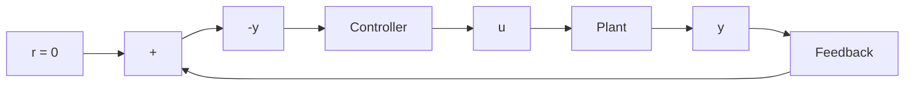

1. Derive a state-space model of the plant.   
2. Choose the desired closed-loop poles for pole placement. Choose the desired observer poles.   
3. Determine the state feedback gain matrix K and the observer gain matrix $\mathbf { K } _ { e }$ .   
4. Using the gain matrices K and Ke obtained in step 3, derive the transfer function of the observer controller. If it is a stable controller, check the response to the given initial condition. If the response is not acceptable, adjust the closed-loop pole location and/or observer pole location until an acceptable response is obtained.

Design step 1: We shall derive the state-space representation of the plant. Since the plant transfer function is

$$\frac {Y (s)}{U (s)} = \frac {1 0 (s + 2)}{s (s + 4) (s + 6)}$$

the corresponding differential equation is

$$\ddot {y} + 1 0 \dot {y} + 2 4 \dot {y} = 1 0 \dot {u} + 2 0 u$$

Referring to Section 2–5, let us define the state variables $x _ { 1 } , x _ { 2 }$ , and $x _ { 3 }$ as follows:

$$x _ {1} = y - \beta_ {0} ux _ {2} = \dot {x} _ {1} - \beta_ {1} ux _ {3} = \dot {x} _ {2} - \beta_ {2} u$$

flowchart

Figure 10–19   
Regulator system.

Also, ${ \dot { x } } _ { 3 }$ is defined by

$$
\begin{array}{l} \dot {x} _ {3} = - a _ {3} x _ {1} - a _ {2} x _ {2} - a _ {1} x _ {3} + \beta_ {3} u \\ = - 2 4 x _ {2} - 1 0 x _ {3} + \beta_ {3} u \\ \end{array}
$$

where b b 1 = 0, 0 = 0, $\beta _ { 2 } = 1 0 $ and, $\beta _ { 3 } = - 8 0$ .

[See Equation (2–35) for the calculation of $\beta \mathrm { ^ { * } s } ]$ Then the state-space equation and output equation can be obtained as

$$
\left[ \begin{array}{c} \dot {x} _ {1} \\ \dot {x} _ {2} \\ \dot {x} _ {3} \end{array} \right] = \left[ \begin{array}{c c c} 0 & 1 & 0 \\ 0 & 0 & 1 \\ 0 & - 2 4 & - 1 0 \end{array} \right] \left[ \begin{array}{c} x _ {1} \\ x _ {2} \\ x _ {3} \end{array} \right] + \left[ \begin{array}{c} 0 \\ 1 0 \\ - 8 0 \end{array} \right] u

y = \left[ \begin{array}{l l l} 1 & 0 & 0 \end{array} \right] \left[ \begin{array}{l} x _ {1} \\ x _ {2} \\ x _ {3} \end{array} \right] + [ 0 ] u
$$

Design step 2: As the first trial, let us choose the desired closed-loop poles at

$$s = - 1 + j 2, \quad s = - 1 - j 2, \quad s = - 5$$

and choose the desired observer poles at

$$s = - 1 0, \qquad s = - 1 0$$

Design step 3: We shall use MATLAB to compute the state feedback gain matrix K and the observer gain matrix $\mathbf { K } _ { e }$ . MATLAB Program 10–11 produces matrices K and $\mathbf { K } _ { e }$ .
