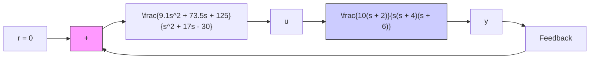

<details>
<summary>flowchart</summary>


</details>

The observer controller has a pole in the right-half s plane (s=1.6119). The existence of an open-loop right-half s plane pole in the observer controller means that the system is open-loop unstable, although the closed-loop system is stable. The latter can be seen from the characteristic equation for the system:

$$
\begin{array}{l} \left| s \mathbf {I} - \mathbf {A} + \mathbf {B K} \right| \cdot \left| s \mathbf {I} - \mathbf {A} _ {b b} + \mathbf {K} _ {e} \mathbf {A} _ {a b} \right| \\ = s ^ {5} + 2 7 s ^ {4} + 2 5 5 s ^ {3} + 1 0 2 5 s ^ {2} + 2 0 0 0 s + 2 5 0 0 \\ = (s + 1 + j 2) (s + 1 - j 2) (s + 5) (s + 1 0) (s + 1 0) = 0 \\ \end{array}
$$

(See MATLAB Program 10–13 for the calculation of the characteristic equation.)

A disadvantage of using an unstable controller is that the system becomes unstable if the dc gain of the system becomes small. Such a control system is neither desirable nor acceptable. Hence, to get a satisfactory system, we need to modify the closed-loop pole location and/or observer pole location.

MATLAB Program 10–13   
```matlab
% Obtaining the characteristic equation
[num1,den1] = ss2tf(A-B*K,eye(3),eye(3),eye(3),1);
[num2,den2] = ss2tf(Abb-Ke*Aab,eye(2),eye(2),eye(2),1);
charact_eq = conv(den1,den2)
charact_eq =
    1.0e+003*
    0.0010  0.0270  0.2550  1.0250  2.0000  2.5000 
```

Second trial: Let us keep the desired closed-loop poles for pole placement as before, but modify the observer pole locations as follows:

$$s = - 4. 5, \quad s = - 4. 5$$

Thus,

$$
\mathbf {L} = \left[ \begin{array}{c c} - 4. 5 & - 4. 5 \end{array} \right]
$$

Using MATLAB, we find the new $\mathbf { K } _ { e }$ to be

$$
\mathbf {K} _ {e} = \left[ \begin{array}{c} - 1 \\ 6. 2 5 \end{array} \right]
$$

Next, we shall obtain the transfer function of the observer controller. MATLAB Program 10–14 produces this transfer function as follows:

$$
\begin{array}{l} G _ {c} (s) = \frac {1 . 2 1 0 9 s ^ {2} + 1 1 . 2 1 2 5 s + 2 5 . 3 1 2 5}{s ^ {2} + 6 s + 2 . 1 4 0 6} \\ = \frac {1 . 2 1 0 9 (s + 5 . 3 5 8 2) (s + 3 . 9 0 1 2)}{(s + 5 . 6 1 9) (s + 0 . 3 8 1)} \\ \end{array}
$$
