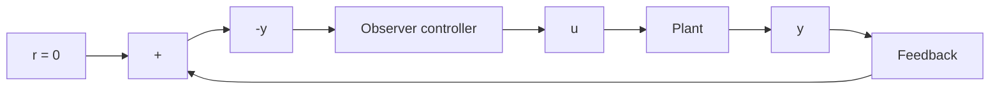
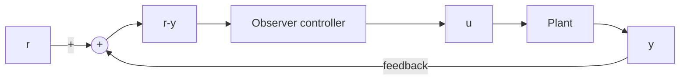

# 10–7 DESIGN OF CONTROL SYSTEMS WITH OBSERVERS

In Section 10–6 we discussed the design of regulator systems with observers. (The systems did not have reference or command inputs.) In this section we consider the design of control systems with observers when the systems have reference inputs or command inputs. The output of the control system must follow the input that is time varying. In following the command input, the system must exhibit satisfactory performance (a reasonable rise time, overshoot, settling time, and so on).

In this section we consider control systems that are designed by use of the poleplacement-with-observer approach. Specifically, we consider control systems using observer controllers. In Section 10–6 we discussed regulator systems, whose block diagram is shown in Figure 10–25. This system has no reference input, or r=0. When the system has a reference input, several different block diagram configurations are conceivable, each having an observer controller.Two of these configurations are shown in Figures 10–26 (a) and (b); we shall consider them in this section.

Figure 10–25 Regulator system.   


<details>
<summary>flowchart</summary>


</details>


<details>
<summary>flowchart</summary>


</details>

Figure 10–26   
(a) Control system with observer controller in the feedforward path; (b) Control system with observer controller in the feedback path.


<details>
<summary>flowchart</summary>

```mermaid
graph LR
    r --> sum((+))
    sum --> r + u
    r + u --> Plant
    Plant --> y
    y --> ObserverController
    ObserverController -->|-u
    -u --> sum
```
</details>
