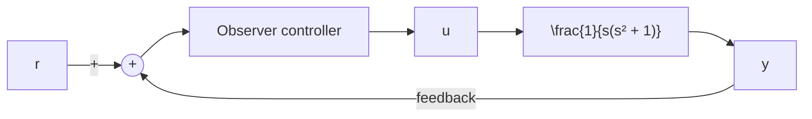

Configuration 1: Consider the system shown in Figure 10–27. In this system the reference input is simply added at the summing point. We would like to design the observer controller such that in the unit-step response the maximum overshoot is less than 30% and the settling time is about 5 sec.

In what follows we first design a regulator system.Then, using the observer controller designed, we simply add the reference input r at the summing point.

Before we design the observer controller, we need to obtain a state-space representation of the plant. Since

$$\frac {Y (s)}{U (s)} = \frac {1}{s \left(s ^ {2} + 1\right)}$$

we obtain

$$\ddot {y} + \dot {y} = u$$

By choosing the state variables as

$$x _ {1} = yx _ {2} = \dot {y}x _ {3} = \ddot {y}$$

we get

$$\dot {\mathbf {x}} = \mathbf {A} \mathbf {x} + \mathbf {B} uy = \mathbf {C x}$$

Figure 10–27

Control system with observer controller in the feedforward path.

flowchart

where

$$
\mathbf {A} = \left[ \begin{array}{c c c} 0 & 1 & 0 \\ 0 & 0 & 1 \\ 0 & - 1 & 0 \end{array} \right], \quad \mathbf {B} = \left[ \begin{array}{c} 0 \\ 0 \\ 1 \end{array} \right], \quad \mathbf {C} = \left[ \begin{array}{c c c} 1 & 0 & 0 \end{array} \right]
$$

Next, we choose the desired closed-loop poles for pole placement at

$$s = - 1 + j, \quad s = - 1 - j, \quad s = - 8$$

and the desired observer poles at

$$s = - 4, \quad s = - 4$$

The state feedback gain matrix K and the observer gain matrix Ke can be obtained as follows:

$$
\mathbf {K} = \left[ \begin{array}{l l l} 1 6 & 1 7 & 1 0 \end{array} \right]

\mathbf {K} _ {e} = \left[ \begin{array}{c} 8 \\ 1 5 \end{array} \right]
$$

See MATLAB Program 10–16.

<table><tr><td>MATLAB Program 10-16</td></tr><tr><td>A = [0 1 0;0 0 1;0 -1 0];B = [0;0;1];J = [-1+j -1-j -8];K = acker(A,B,J)K =16 17 10Aab = [1 0];Abb = [0 1;-1 0];L = [-4 -4];Ke = acker(Abb&#x27;,Aab&#x27;,L)&#x27;Ke =815</td></tr></table>

The transfer function of the observer controller is obtained by use of MATLAB Program 10–17. The result is

$$
\begin{array}{l} G _ {c} (s) = \frac {3 0 2 s ^ {2} + 3 0 3 s + 2 5 6}{s ^ {2} + 1 8 s + 1 1 3} \\ = \frac {3 0 2 (s + 0 . 5 0 1 7 + j 0 . 7 7 2) (s + 0 . 5 0 1 7 - j 0 . 7 7 2)}{(s + 9 + j 5 . 6 5 6 9) (s + 9 - j 5 . 6 5 6 9)} \\ \end{array}
$$
