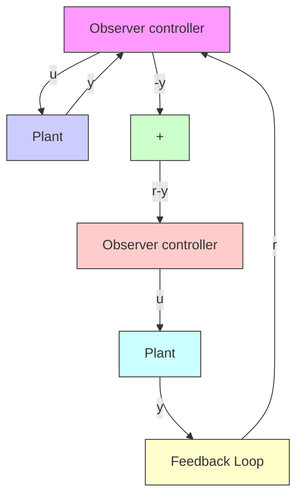

<table><tr><td>MATLAB Program 10-17</td></tr><tr><td>% Determination of transfer function of observer controller</td></tr><tr><td>A = [0 1 0;0 0 1;0 -1 0];</td></tr><tr><td>B = [0;0;1];</td></tr><tr><td>Aaa = 0; Aab = [1 0]; Aba = [0;0]; Abb = [0 1;-1 0];</td></tr><tr><td>Ba = 0; Bb = [0;1];</td></tr><tr><td>Ka = 16; Kb=[17 10];</td></tr><tr><td>Ke = [8;15];</td></tr><tr><td>Ahat = Abb - Ke*Aab;</td></tr><tr><td>Bhat = Ahat*Ke + Aba - Ke*Aaa;</td></tr><tr><td>Fhat = Bb - Ke*Ba;</td></tr><tr><td>Atilde = Ahat - Fhat*Kb;</td></tr><tr><td>Btilde = Bhat - Fhat*(Ka + Kb*Ke);</td></tr><tr><td>Ctilde = -Kb;</td></tr><tr><td>Dtilde = -(Ka + Kb*Ke);</td></tr><tr><td>[num,den] = ss2tf(Atilde,Btilde,-Ctilde,-Dtilde)</td></tr><tr><td>num =</td></tr><tr><td>302.0000 303.0000 256.0000</td></tr><tr><td>den =</td></tr><tr><td>1 18 113</td></tr></table>

Figure 10–28 shows the block diagram of the regulator system just designed. Figure 10–29 shows the block diagram of a possible configuration of the control system based on the regulator system shown in Figure 10–28. The unit-step response curve for this control system is shown in Figure 10–30.The maximum overshoot is about 28% and the settling time is about 4.5 sec.Thus, the designed system satisfies the design requirements.

Figure 10–28 Regulator system with observer controller.   
Figure 10–29 Control system with observer controller in the feedforward path.   

flowchart

Figure 10–30 Unit-step response of the control system shown in Figure 10–29.   

line

| t (sec) | Output y |
| --- | --- |
| 0 | 0.0 |
| 1 | 1.3 |
| 2 | 0.8 |
| 3 | 0.85 |
| 4 | 0.95 |
| 5 | 1.0 |
| 6 | 1.0 |
| 7 | 1.0 |
| 8 | 1.0 |
| 9 | 1.0 |
| 10 | 1.0 |

