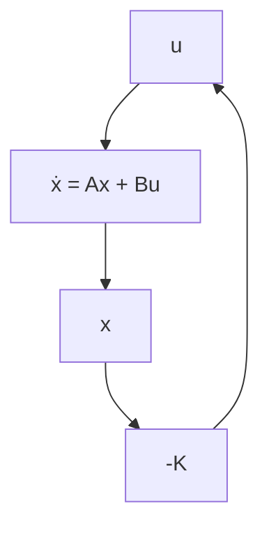

# 10–8 QUADRATIC OPTIMAL REGULATOR SYSTEMS

An advantage of the quadratic optimal control method over the pole-placement method is that the former provides a systematic way of computing the state feedback control gain matrix.

Quadratic Optimal Regulator Problems. We shall now consider the optimal regulator problem that, given the system equation

$$\dot {\mathbf {x}} = \mathbf {A} \mathbf {x} + \mathbf {B} \mathbf {u} \tag {10-112}$$

determines the matrix K of the optimal control vector

$$\mathbf {u} (t) = - \mathbf {K x} (t) \tag {10-113}$$

so as to minimize the performance index

$$J = \int_ {0} ^ {\infty} (\mathbf {x} ^ {*} \mathbf {Q x} + \mathbf {u} ^ {*} \mathbf {R u}) d t \tag {10-114}$$

where Q is a positive-definite (or positive-semidefinite) Hermitian or real symmetric matrix and R is a positive-definite Hermitian or real symmetric matrix. Note that the second term on the right-hand side of Equation (10–114) accounts for the expenditure of the energy of the control signals. The matrices Q and R determine the relative importance of the error and the expenditure of this energy. In this problem, we assume that the control vector u(t) is unconstrained.

As will be seen later, the linear control law given by Equation (10–113) is the optimal control law. Therefore, if the unknown elements of the matrix K are determined so as to minimize the performance index, then $\mathbf { u } ( t ) = - \mathbf { K } \mathbf { x } ( t )$ is optimal for any initial state x(0). The block diagram showing the optimal configuration is shown in Figure 10–35.

flowchart

Figure 10–35   
Optimal regulator system.

Now let us solve the optimization problem. Substituting Equation (10–113) into Equation (10–112), we obtain

$$\dot {\mathbf {x}} = \mathbf {A} \mathbf {x} - \mathbf {B} \mathbf {K} \mathbf {x} = (\mathbf {A} - \mathbf {B} \mathbf {K}) \mathbf {x}$$

In the following derivations, we assume that the matrix A-BK is stable, or that the eigenvalues of A-BK have negative real parts.

Substituting Equation (10–113) into Equation (10–114) yields
