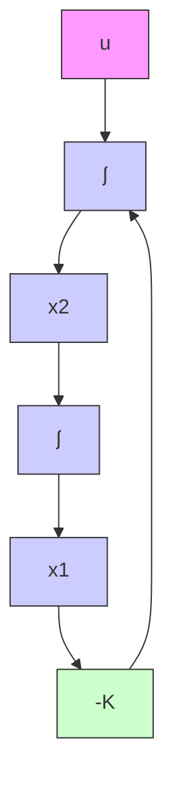
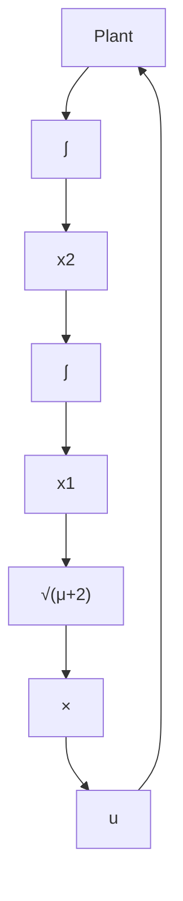

$$
\left[ \begin{array}{c c} 0 & 0 \\ p _ {1 1} & p _ {1 2} \end{array} \right] + \left[ \begin{array}{c c} 0 & p _ {1 1} \\ 0 & p _ {1 2} \end{array} \right] - \left[ \begin{array}{c c} p _ {1 2} ^ {2} & p _ {1 2} p _ {2 2} \\ p _ {1 2} p _ {2 2} & p _ {2 2} ^ {2} \end{array} \right] + \left[ \begin{array}{c c} 1 & 0 \\ 0 & \mu \end{array} \right] = \left[ \begin{array}{c c} 0 & 0 \\ 0 & 0 \end{array} \right]
$$

flowchart

Figure 10–36 Control system.

Figure 10–37 Optimal control of the plant shown in Figure 10–36.   

flowchart

from which we obtain the following three equations:

$$1 - p _ {1 2} ^ {2} = 0p _ {1 1} - p _ {1 2} p _ {2 2} = 0\mu + 2 p _ {1 2} - p _ {2 2} ^ {2} = 0$$

Solving these three simultaneous equations for $p _ { 1 1 } , p _ { 1 2 }$ , and $p _ { 2 2 }$ , requiring P to be positive definite, we obtain

$$
\mathbf {P} = \left[ \begin{array}{c c} p _ {1 1} & p _ {1 2} \\ p _ {1 2} & p _ {2 2} \end{array} \right] = \left[ \begin{array}{c c} \sqrt {\mu + 2} & 1 \\ 1 & \sqrt {\mu + 2} \end{array} \right]
$$

Referring to Equation (10–117), the optimal feedback gain matrix K is obtained as

$$
\begin{array}{l} \mathbf {K} = \mathbf {R} ^ {- 1} \mathbf {B} ^ {*} \mathbf {P} \\ = [ 1 ] [ 0 \quad 1 ] \left[ \begin{array}{c c} p _ {1 1} & p _ {1 2} \\ p _ {1 2} & p _ {2 2} \end{array} \right] \\ = \left[ \begin{array}{c c} p _ {1 2} & p _ {2 2} \end{array} \right] \\ = \left[ \begin{array}{c c} 1 & \sqrt {\mu + 2} \end{array} \right] \\ \end{array}
$$

Thus, the optimal control signal is

$$u = - \mathbf {K} \mathbf {x} = - x _ {1} - \sqrt {\mu + 2} x _ {2} \tag {10-120}$$

Note that the control law given by Equation (10–120) yields an optimal result for any initial state under the given performance index. Figure 10–37 is the block diagram for this system.

Since the characteristic equation is
