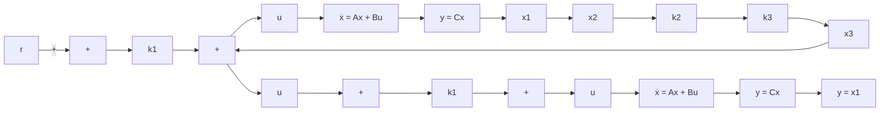

$$
\mathbf {Q} = \left[ \begin{array}{c c c} q _ {1 1} & 0 & 0 \\ 0 & q _ {2 2} & 0 \\ 0 & 0 & q _ {3 3} \end{array} \right], \qquad R = 1, \qquad \mathbf {x} = \left[ \begin{array}{c} x _ {1} \\ x _ {2} \\ x _ {3} \end{array} \right] = \left[ \begin{array}{c} y \\ \dot {y} \\ \ddot {y} \end{array} \right]
$$

Figure 10–39 Control system.   

flowchart

To get a fast response, $q _ { 1 1 }$ must be sufficiently large compared with $q _ { 2 2 } , q _ { 3 3 }$ , and R. In this problem, we choose

$$q _ {1 1} = 1 0 0, \quad q _ {2 2} = q _ {3 3} = 1, \quad R = 0. 0 1$$

To solve this problem with MATLAB, we use the command

$$K = \operatorname{lqr} (A, B, Q, R)$$

MATLAB Program 10–22 yields the solution to this problem.
