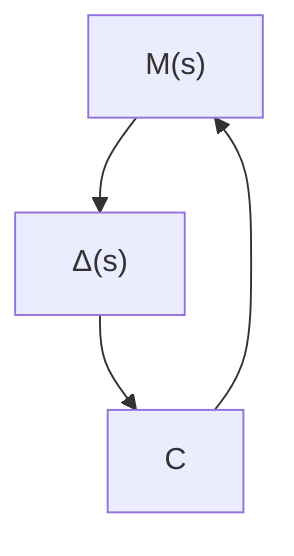

In robust control theory we measure the magnitude of the transfer function by the $H _ { \infty }$ norm. Assume that the transfer function $\Phi ( s )$ is proper and stable. [Note that a transfer function $\Phi ( s )$ is called proper if $\Phi ( \infty )$ is limited and definite. If $\Phi ( \infty ) = 0 $ , it is called strictly proper.] The $H _ { \infty }$ norm of $\Phi ( s )$ is defined by

$$\left\| \Phi \right\| _ {\infty} = \overline {{\sigma}} [ \Phi (j \omega) ]$$

$\overline { { \sigma } } \left[ \Phi ( j \omega ) \right]$ means the maximum singular value of $[ \Phi ( j \omega ) ] . ( \overline { { \sigma } }$ means $\sigma _ { \mathrm { m a x } } . )$ Note that the singular value of a transfer function is defined by£

$$\sigma_ {i} (\Phi) = \sqrt {\lambda_ {i} (\Phi^ {*} \Phi)}$$

where $\lambda _ { i } ( \Phi ^ { * } \Phi )$ is the ith largest eigenvalue of $\Phi ^ { * } \Phi$ and it is always a non-negative real value. By making $\| \Phi \| _ { \infty }$ smaller, we make the effect of input w on the output z smaller. It is frequently the case that instead of using the maximum singular value $\| \Phi \| _ { \infty } ,$ we use the inequality

$$\| \Phi \| _ {\infty} < \gamma$$

and limit the magnitude of $\Phi ( s )$ by .To make the magnitude ofg $\| \Phi \| _ { \infty }$ small, we choose a small and require thatg $\| \Phi \| _ { \infty } < \gamma$ .

  
Figure 10–41 Bode diagram and the $H _ { \infty }$ norm $\| \Phi \| _ { \infty } .$

Figure 10–42   
Closed-loop system.   

flowchart

Small-Gain Theorem. Consider the closed-loop system shown in Figure 10–42. In the figure $\Delta ( s )$ and $M ( s )$ are stable and proper transfer functions.

The small-gain theorem states that if

$$\| \Delta (s) M (s) \| _ {\infty} < 1$$

then this closed-loop system is stable. That is, if the $H _ { \infty }$ norm of $\Delta ( s ) M ( s )$ is smaller than 1, this closed-loop system is stable. This theorem is an extension of the Nyquist stability criterion.
