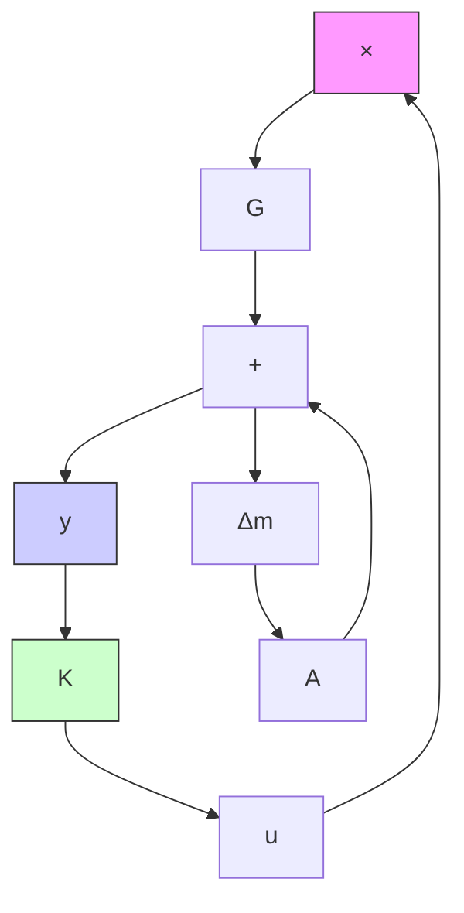
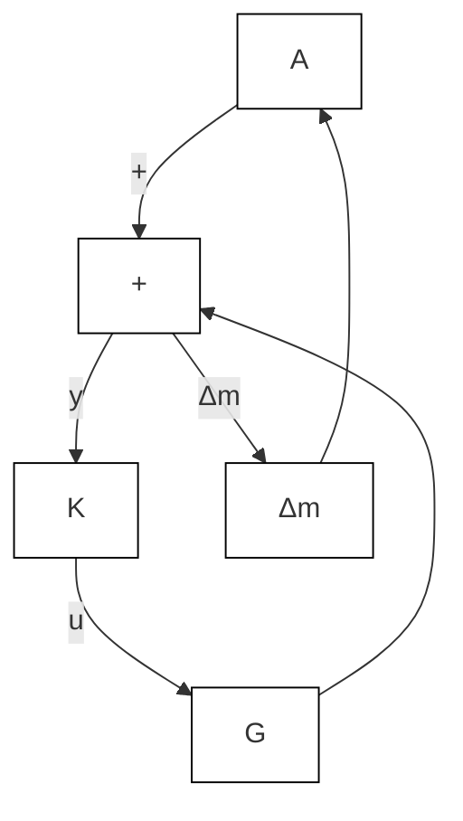
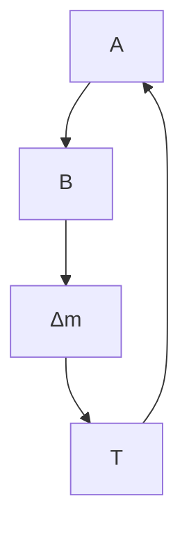
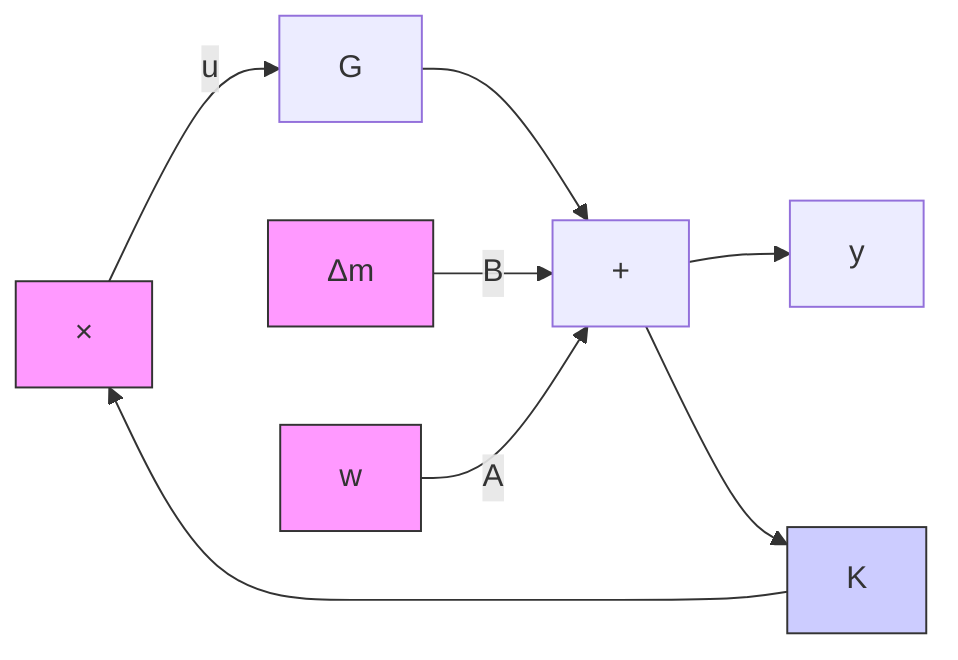
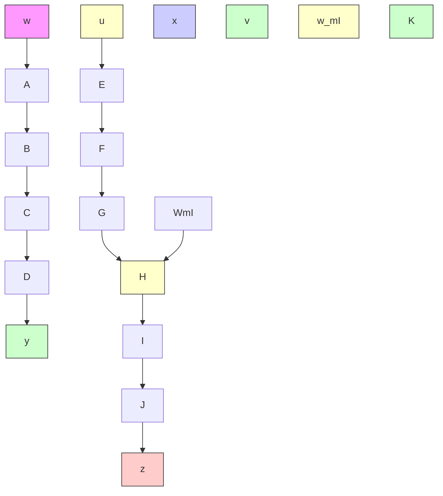

Clearly, for a stable plant model G(s), K(s)=0 will satisfy Inequality (10–125). However, $K ( s ) = 0$ is not the desirable transfer function for the controller. To find an acceptable transfer function for $K ( s )$ , we may add another condition—for example, that the resulting system will have robust performance such that the system output follows the input with minimum error, or another reasonable condition. In what follows we shall obtain the condition for robust performance.

flowchart

flowchart

flowchart

flowchart

flowchart

