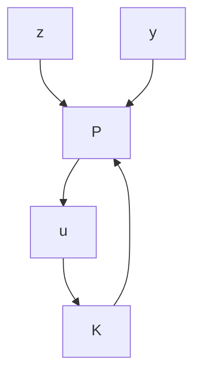

flowchart

Figure 10–43

(a) Block diagram of a system with unstructured multiplicative uncertainty;   
(b)–(d) successive modifications of the block diagram of (a);   
(e) block diagram showing a generalized plant with unstructured multiplicative uncertainty;   
(f) generalized plant diagram.

Robust Performance. Consider the system shown in Figure 10–44. Suppose that we want the output $y ( t )$ to follow the input $\boldsymbol { r } ( t )$ as closely as possible, or we wish to have

$$\lim _ {t \rightarrow \infty} [ r (t) - y (t) ] = \lim _ {t \rightarrow \infty} e (t) \rightarrow 0$$

Since the transfer function $Y ( s ) / R ( s )$ is

$$\frac {Y (s)}{R (s)} = \frac {K G}{1 + K G}$$

we have

$$\frac {E (s)}{R (s)} = \frac {R (s) - Y (s)}{R (s)} = 1 - \frac {Y (s)}{R (s)} = \frac {1}{1 + K G}$$

Define

$$\frac {1}{1 + K G} = S$$

where S is commonly called the sensitivity function and T defined by Equation (10–124) is called the complementary sensitivity function. In this robust performance problem we want to make the $H _ { \infty }$ norm of S smaller than the desired transfer function $W _ { s } ^ { - 1 }$ or $\bar { \| } S \| _ { \infty } < W _ { s } ^ { - 1 }$ which can be written as

$$\left\| W _ {s} S \right\| _ {\infty} < 1 \tag {10-126}$$

Combining Inequalities (10–123) and (10–126), we get

$$
\left\| \begin{array}{c} W _ {m} T \\ W _ {s} S \end{array} \right\| _ {\infty} <   1
$$

where $T + S = 1$ , or

$$
\left\| \begin{array}{c} W _ {m} (s) \frac {K (s) G (s)}{1 + K (s) G (s)} \\ W _ {s} (s) \frac {1}{1 + K (s) G (s)} \end{array} \right\| _ {\infty} <   1 \tag {10-127}
$$

Our problem then becomes to find $K ( s )$ that will satisfy Inequality (10–127). Note that depending on the chosen $W _ { m } ( s )$ and $W _ { s } ( s )$ there may be many $K ( s )$ that satisfy Inequality (10–127), or may be no $K ( s )$ that satisfies Inequality (10–127). Such a robust control problem using Inequality (10–127) is called a mixed-sensitivity problem.

Figure 10–45(a) is a generalized plant diagram, where two conditions (robust stability and robust performance) are specified. A simplified version of this diagram is shown in Figure 10–45(b).

Figure 10–44 Closed-loop system.   

flowchart

