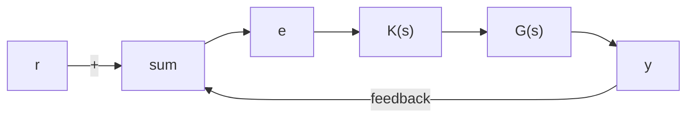
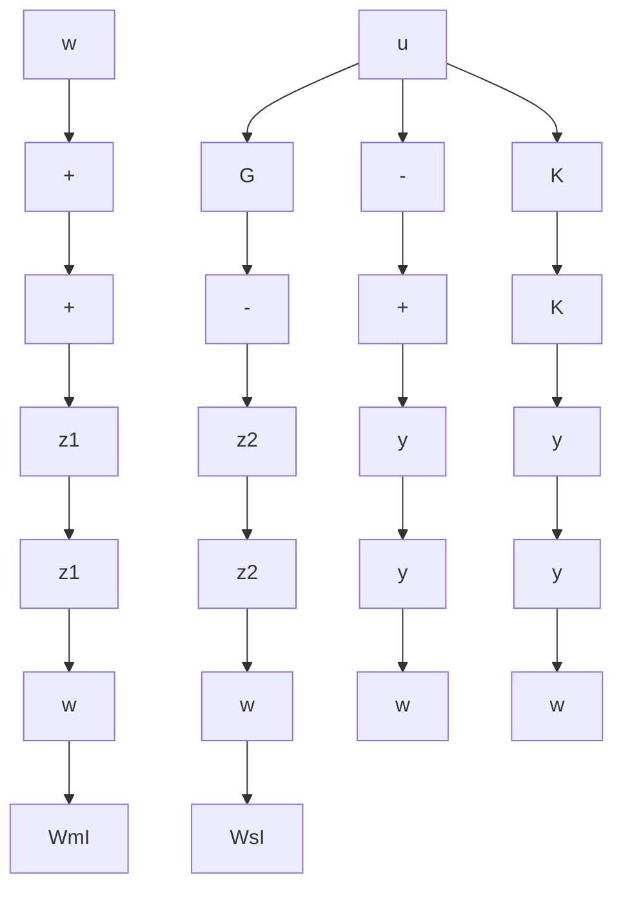
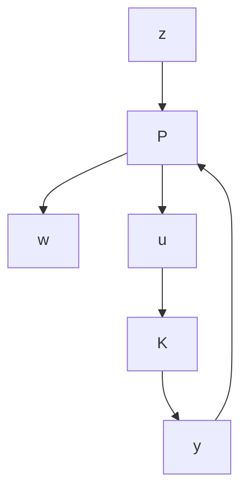
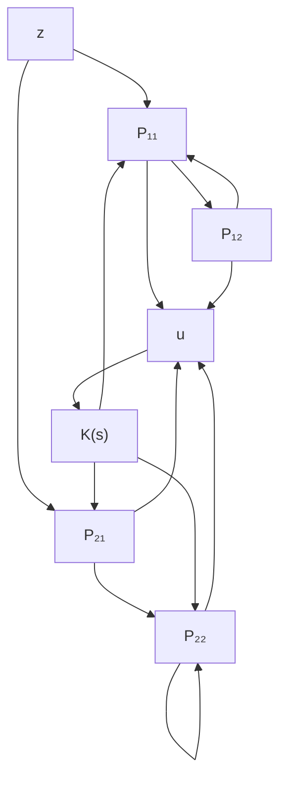

flowchart

Figure 10–45   
(a) Generalized plant diagram; (b) simplfied version of the generalized plant diagram shown in (a).

flowchart

(b)

Finding Transfer Function $z ( s ) / w ( s )$ from a Generalized Plant Diagram. Consider the generalized plant diagram shown in Figure 10–46.

In this diagram $w ( s )$ is the exogenous disturbance and $u ( s )$ is the manipulated variable. $z ( s )$ is the controlled variable and $y ( s )$ is the observed variable.

Consider this control system consisting of the generalized plant $P ( s )$ and the controller K(s).The equation that relates the outputs $z ( s )$ and $y ( s )$ and the inputs $w ( s )$ and $u ( s )$ of the generalized plant $P ( s )$ is

$$
\left[ \begin{array}{c} z (s) \\ y (s) \end{array} \right] = \left[ \begin{array}{c c} P _ {1 1} & P _ {1 2} \\ P _ {2 1} & P _ {2 2} \end{array} \right] \left[ \begin{array}{c} w (s) \\ u (s) \end{array} \right]
$$

The equation that relates $u ( s )$ and $y ( s )$ is given by

$$u (s) = K (s) y (s)$$

Define the transfer function that relates the controlled variable $\mathbf { \boldsymbol { z } } ( \mathbf { \boldsymbol { s } } )$ to the exogenous disturbance $w ( s )$ as $\Phi ( s )$ . Then

$$z (s) = \Phi (s) w (s)$$

Figure 10–46

A generalized plant diagram.

flowchart

Note that can be determined as follows: Since£(s)
