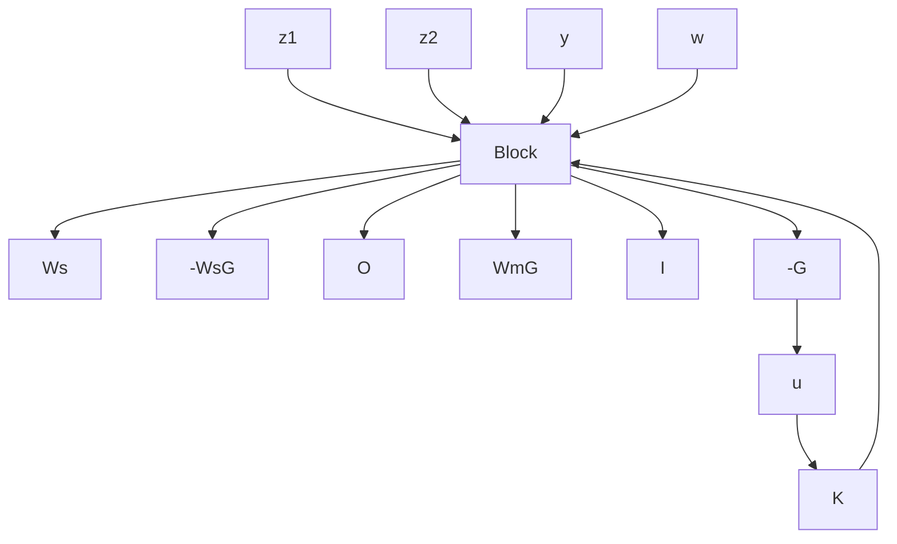

Figure 10–47 Generalized plant of the system discussed in Example 10–15.   

flowchart

If both the robust stability and robust performance conditions are required, the control system must satisfy the condition given by Inequality (10–127), rewritten as

$$
\left\| \begin{array}{c} W _ {m} \frac {K G}{1 + K G} \\ W _ {s} \frac {1}{1 + K G} \end{array} \right\| <   1 \tag {10-134}
$$

For the P matrix, we combine Equations (10–133) and (10–131) and get

$$
P = \left[ \begin{array}{c c} W _ {s} & - W _ {s} G \\ 0 & W _ {m} G \\ I & - G \end{array} \right] \tag {10-135}
$$

If we construct P(s) as given by Equation (10–135), then the problem of designing a control system to satisfy both robust stability and robust performance conditions can be formulated by using the generalized plant represented by Equation (10–135). As mentioned earlier, such a problem is called a mixed-sensitivity problem. By using the generalized plant given by Equation (10–135) we are able to determine the controller K(s) that satisfies Inequality (10–134). The generalized plant diagram for the system considered in Example 10–14 becomes as shown in Figure 10–47.

H Infinity Control Problem. To design a controller K of a control system to satisfy various stability and performance specifications, we utilize the concept of the generalized plant.

As mentioned earlier a generalized plant is a linear model consisting of a model of the plant and weighting functions corresponding to the specifications for the required performance. Referring to the generalized plant shown in Figure 10–48, the H infinity control problem is a problem to design a controller K that will make the $H _ { \infty }$ norm of the transfer function from the exogenous disturbance w to the controlled variable z less than a specified value.

Figure 10–48 A generalized plant diagram.   

flowchart

