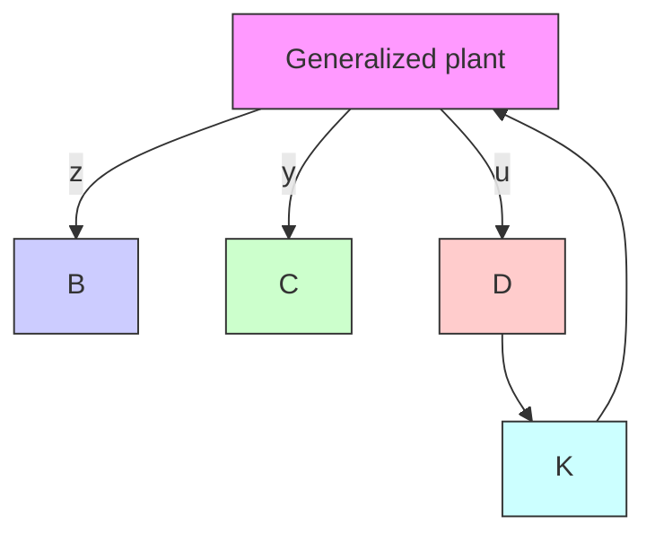

The reason to use generalized plants, rather than individual block diagrams of control systems, is that a number of control systems with uncertain elements have been designed using generalized plants and, consequently, established design approaches using such plants are available.

Note that any weighting function, such as $W ( s )$ , is an important parameter to influence the resulting controller $K ( s )$ . In fact, the goodness of the resulting designed system depends on the choice of the weighting function or functions used in the design process.

Note that the controller that is the solution to the H infinity control problem is commonly called the H infinity controller.

Solving Robust Control Problems. There are three established approaches to solve robust control problems. They are

1. Solve robust control problems by deriving the Riccati equations and solving them.   
2. Solve robust control problems by using the linear matrix inequality approach.   
3. Solve robust control problems that involve structural uncertainties by using the $\mu$ analysis and $\mu$ synthesis approach.

Solving robust control problems by use of any of the above methods requires a broad mathematical background.

In this section we have presented only an introduction to the robust control theory. Solving any robust control problem requires mathematical background beyond the scope of the senior engineering student. Therefore, an interested reader may take a graduate-level control course at an established college or university and study this subject in detail.
