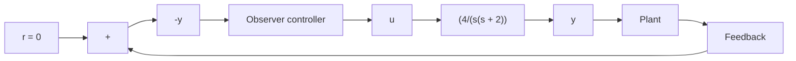

Figure 10–51 Regulator system.   

flowchart

(b) for the minimum-order observer:

$$x _ {1} (0) = 1, \quad x _ {2} (0) = 0, \quad e _ {1} (0) = 1$$

Also, compare the bandwidths of both systems.

Solution. We first determine the state-space representation of the system. By defining state variables $x _ { 1 }$ and $x _ { 2 }$ as

$$x _ {1} = yx _ {2} = \dot {y}$$

we obtain

$$
\left[ \begin{array}{c} \dot {x} _ {1} \\ \dot {x} _ {2} \end{array} \right] = \left[ \begin{array}{c c} 0 & 1 \\ 0 & - 2 \end{array} \right] \left[ \begin{array}{c} x _ {1} \\ x _ {2} \end{array} \right] + \left[ \begin{array}{c} 0 \\ 4 \end{array} \right] u

y = \left[ \begin{array}{c c} 1 & 0 \end{array} \right] \left[ \begin{array}{c} x _ {1} \\ x _ {2} \end{array} \right]
$$

For the pole-placement part, we determine the state feedback gain matrix K. Using MATLAB, we find K to be

$$
\mathbf {K} = \left[ \begin{array}{c c} 4 & 0. 5 \end{array} \right]
$$

(See MATLAB Program 10–28.)

Next, we determine the observer gain matrix $\mathbf { K } _ { e }$ for the full-order observer. Using MATLAB, we find $\mathbf { K } _ { e }$ to be

$$
\mathbf {K} _ {e} = \left[ \begin{array}{c} 1 4 \\ 3 6 \end{array} \right]
$$

(See MATLAB Program 10–28.)
