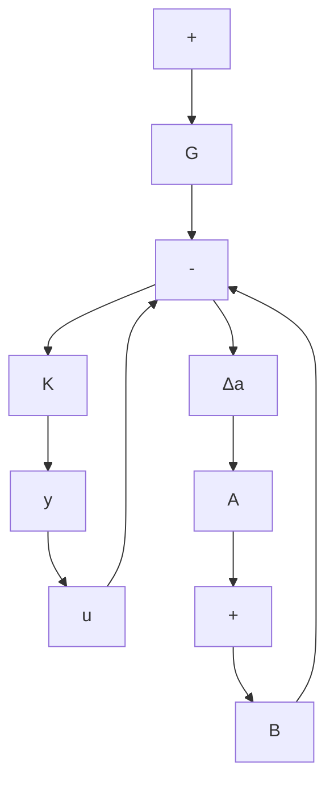
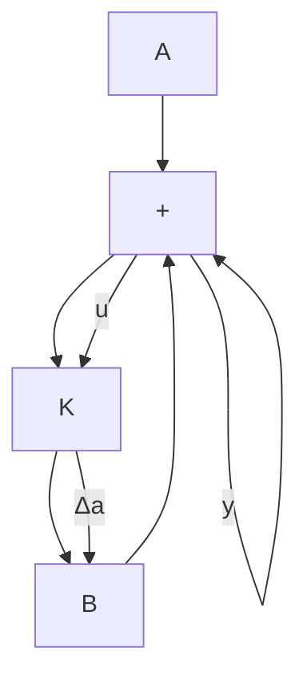
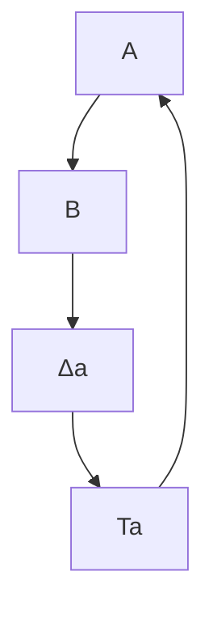

line

| t (sec) | x² |
| --- | --- |
| 0 | 0.05 |
| 2 | -0.03 |
| 4 | 0.01 |
| 6 | 0.005 |
| 8 | 0.002 |
| 10 | 0.001 |

line

| t (sec) | x3 |
| --- | --- |
| 0 | 0.0 |
| 2 | 0.5 |
| 4 | 0.9 |
| 6 | 1.0 |
| 8 | 1.0 |
| 10 | 1.0 |

line

| t (sec) | x4 |
| --- | --- |
| 0 | 0.0000 |
| 1 | 0.2500 |
| 2 | 0.3500 |
| 3 | 0.3000 |
| 4 | 0.2000 |
| 5 | 0.1000 |
| 6 | 0.0500 |
| 7 | 0.0200 |
| 8 | 0.0100 |
| 9 | 0.0050 |
| 10 | 0.0025 |

line

| t (sec) | x5 |
| --- | --- |
| 0 | 0 |
| 2 | 2 |
| 4 | 2.5 |
| 6 | 2.7 |
| 8 | 2.7 |
| 10 | 2.7 |

Figure 10–55   
Response curves to a unit-step input.

line

| t (sec) | Cart Position x₃ |
| --- | --- |
| 0 | 0.0 |
| 1 | 0.1 |
| 2 | 0.4 |
| 3 | 0.7 |
| 4 | 0.9 |
| 5 | 1.0 |
| 6 | 1.0 |
| 7 | 1.0 |
| 8 | 1.0 |
| 9 | 1.0 |
| 10 | 1.0 |

Figure 10–56   
Cart position versus t curve.

A–10–18. Consider the stability of a system with unstructured additive uncertainty as shown in Figure 10–57(a). Define

$\widetilde { G }$ true plant dynamics=

G=model of plant dynamics

$\Delta _ { a }$ = unstructured additive uncertainty

flowchart

(a)

flowchart

(b)

flowchart

(c)

flowchart

