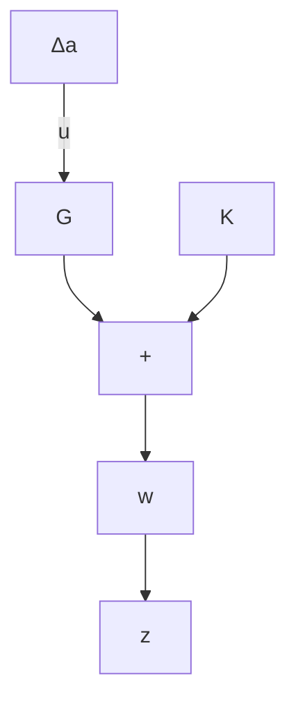
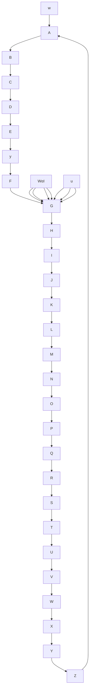
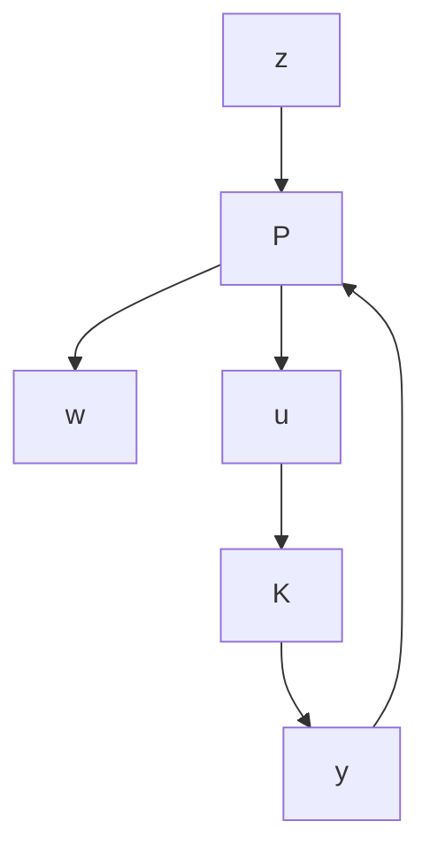

(d)

flowchart

flowchart

(f)   
Figure 10–57

(a) Block diagram of a system with unstructured additive uncertainty;   
(b)–(d) successive modifications of the block diagram of (a);   
(e) block diagram showing a generalized plant with unstructured additive uncertainty;   
(f) generalized plant diagram.

Assume that $\Delta _ { a }$ is stable and its upper bound is known.Assume also that $\widetilde { G }$ and G are related by

$$\widetilde {G} = G + \Delta_ {a}$$

Obtain the condition that the controller K must satisfy for robust stability. Also, obtain a generalized plant diagram for this system.

Solution. Let us obtain the transfer function between point A and point B in Figure 10–57(a). Redrawing Figure 10–57(a), we obtain Figure 10–57(b).Then the transfer function between points A and B can be obtained as

$$\frac {K}{1 + G K} = K (1 + G K) ^ {- 1}$$

Define

$$K (1 + G K) ^ {- 1} = T _ {a}$$

Then Figure 10–57(b) can be redrawn as Figure 10–57(c). By using the small-gain theorem, the condition for the robust stability of the closed-loop system can be obtained as

$$\left\| \Delta_ {a} T _ {a} \right\| _ {\infty} < 1 \tag {10-180}$$

Since it is impossible to model $\Delta _ { a }$ precisely, we need to find a scalar transfer function $W _ { a } ( j \omega )$ such that

$$\overline {{{\sigma}}} \{\Delta_ {a} (j \omega) \} < | W _ {a} (j \omega) | \quad \text { for all } \omega$$

and use this $W _ { a } ( j \omega )$ instead of $\Delta _ { a } .$ . Then, the condition for the robust stability of the closed-loop system can be given by

$$\left\| W _ {a} T _ {a} \right\| _ {\infty} < 1 \tag {10-181}$$
