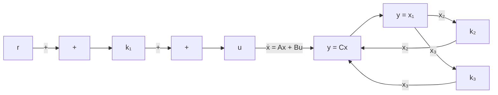

$$
\mathbf {A} = \left[ \begin{array}{c c c} 0 & 1 & 0 \\ 0 & 0 & 1 \\ 0 & - 5 & - 6 \end{array} \right], \quad \mathbf {B} = \left[ \begin{array}{l} 0 \\ 0 \\ 1 \end{array} \right], \quad \mathbf {C} = \left[ \begin{array}{c c c} 1 & 0 & 0 \end{array} \right]
$$

Determine the feedback gain constants $k _ { 1 } , k _ { 2 } ,$ , and $k _ { 3 }$ such that the closed-loop poles are located at

$$s = - 2 + j 4, \quad s = - 2 - j 4, \quad s = - 1 0$$

Obtain the unit-step response and plot the output y(t)-versus-t curve.

flowchart

Figure 10–58   
Type 1 servo system.

B–10–9. Consider the inverted-pendulum system shown in Figure 10–59. Assume that

$$M = 2 \mathrm{kg}, \quad m = 0. 5 \mathrm{kg}, \quad l = 1 \mathrm{m}$$

Define state variables as

$$x _ {1} = \theta , \qquad x _ {2} = \dot {\theta}, \qquad x _ {3} = x, \qquad x _ {4} = \dot {x}$$

and output variables as

$$y _ {1} = \theta = x _ {1}, \quad y _ {2} = x = x _ {3}$$

Derive the state-space equations for this system.

It is desired to have closed-loop poles at

$$s = - 4 + j 4, \quad s = - 4 - j 4, \quad s = - 2 0, \quad s = - 2 0$$

Determine the state-feedback gain matrix K.

Using the state-feedback gain matrix K thus determined, examine the performance of the system by computer simulation.Write a MATLAB program to obtain the response of the system to an arbitrary initial condition. Obtain the response curves $x _ { 1 } ( t )$ versus $t , x _ { 2 } ( t )$ versus $t , x _ { 3 } ( t )$ versus t, and $x _ { 4 } ( t )$ versus t for the following set of initial condition:

$$x _ {1} (0) = 0, \quad x _ {2} (0) = 0, \quad x _ {3} (0) = 0, \quad x _ {4} (0) = 1 \mathrm{m/s}$$

text_image

z
x → ℓ sin θ
ℓ cos θ
θ
m
mg
ℓ
0 → x
P
u → M

Figure 10–59

Inverted-pendulum system.

B–10–10. Consider the system defined by

$$\dot {\mathbf {x}} = \mathbf {A} \mathbf {x}y = \mathbf {C x}$$

where

$$
\mathbf {A} = \left[ \begin{array}{c c} - 1 & 1 \\ 1 & - 2 \end{array} \right], \quad \mathbf {C} = \left[ \begin{array}{l l} 1 & 0 \end{array} \right]
$$

Design a full-order state observer. The desired observer poles are s=–5 and s=–5.
