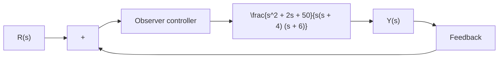

$$
\mathbf {A} = \left[ \begin{array}{c c c} 0 & 1 & 0 \\ 0 & 0 & 1 \\ - 6 & - 1 1 & - 6 \end{array} \right], \quad \mathbf {B} = \left[ \begin{array}{l} 0 \\ 0 \\ 1 \end{array} \right], \quad \mathbf {C} = \left[ \begin{array}{c c c} 1 & 0 & 0 \end{array} \right]
$$

Design a regulator system by the pole-placement-withobserver approach. Assume that the desired closed-loop poles for pole placement are located at

$$s = - 1 + j, \quad s = - 1 - j, \quad s = - 5$$

The desired observer poles are located at

$$s = - 6, \quad s = - 6, \quad s = - 6$$

Also, obtain the transfer function of the observer controller.

B–10–15. Using the pole-placement-with-observer approach, design observer controllers (one with a full-order observer and the other with a minimum-order observer) for the system shown in Figure 10–60. The desired closed-loop poles for the pole-placement part are

$$s = - 1 + j 2, \qquad s = - 1 - j 2, \qquad s = - 5$$


<details>
<summary>flowchart</summary>


</details>

Figure 10–60

Control system with observer controller in the feedforward path.

The desired observer poles are

$s = - 1 0 , s = - 1 0 , s = - 1 0 \mathrm { ~ f o r ~ t h e ~ f u l l - o r d e r ~ o b s e r v e r }$

$s = - 1 0 , s = - 1 0 \mathrm { ~ f o r t h e ~ m i n i m u m \mathrm { - } o r d e r ~ o b s e r v e r } .$

Compare the unit-step responses of the designed systems. Compare also the bandwidths of both systems.

B–10–16. Using the pole-placement-with-observer approach, design the control systems shown in Figures 10–61(a) and (b). Assume that the desired closed-loop poles for the pole placement are located at

$$s = - 2 + j 2, \quad s = - 2 - j 2$$

and the desired observer poles are located at

$$s = - 8, \quad s = - 8$$

Obtain the transfer function of the observer controller. Compare the unit-step responses of both systems. [In System (b), determine the constant N so that the steady-state output y(q) is unity when the input is a unit-step input.]


<details>
<summary>flowchart</summary>

```mermaid
graph LR
    R["s"] --> +
    + --> Observer["Observer controller"]
    Observer --> |1/(s(s+1)|| Y["s"]
    Y["s"] --> -
    - --> +
    + --> -
    - --> -
```
</details>

(a)
