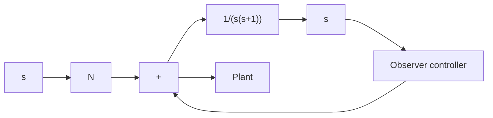
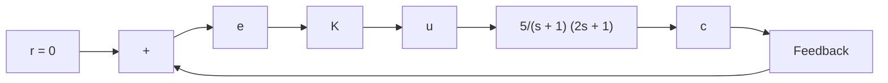

flowchart

(b)   
Figure 10–61

Control systems with observer controller: (a) observer controller in the feedforward path; (b) observer controller in the feedback path.

B–10–17. Consider the system defined by

$$\dot {\mathbf {x}} = \mathbf {A} \mathbf {x}$$

where

$$
\mathbf {A} = \left[ \begin{array}{c c c} 0 & 1 & 0 \\ 0 & 0 & 1 \\ - 1 & - 2 & - a \end{array} \right]
a = \text { adjustable parameter } > 0
$$

Determine the value of the parameter a so as to minimize the following performance index:

$$J = \int_ {0} ^ {\infty} \mathbf {x} ^ {T} \mathbf {x} d t$$

Assume that the initial state x(0) is given by

$$
\mathbf {x} (0) = \left[ \begin{array}{c} c _ {1} \\ 0 \\ 0 \end{array} \right]
$$

B–10–18. Consider the system shown in Figure 10–62. Determine the value of the gain K so that the damping ratio z of the closed-loop system is equal to 0.5. Then determine also the undamped natural frequency $\omega _ { n }$ of the closed-loop system. Assuming that e(0)=1 and evaluatee  (0) = 0,

$$\int_ {0} ^ {\infty} e ^ {2} (t) d t$$

flowchart

Figure 10–62

Control system.

B–10–19. Determine the optimal control signal u for the system defined by

$$\dot {\mathbf {x}} = \mathbf {A} \mathbf {x} + \mathbf {B} u$$

where

$$
\mathbf {A} = \left[ \begin{array}{c c} 0 & 1 \\ 0 & - 1 \end{array} \right], \qquad \mathbf {B} = \left[ \begin{array}{c} 0 \\ 1 \end{array} \right]
$$

such that the following performance index is minimized:

$$J = \int_ {0} ^ {\infty} \left(\mathbf {x} ^ {T} \mathbf {x} + u ^ {2}\right) d t$$

B–10–20. Consider the system

$$
\left[ \begin{array}{c} \dot {x} _ {1} \\ \dot {x} _ {2} \end{array} \right] = \left[ \begin{array}{c c} 0 & 1 \\ 0 & 0 \end{array} \right] \left[ \begin{array}{c} x _ {1} \\ x _ {2} \end{array} \right] + \left[ \begin{array}{c} 0 \\ 1 \end{array} \right] u
$$
