```mermaid
graph LR
    A["q*(t)"] --> B["-1"]
    B --> C["-q*(t)"]
    C --> D["+1"]
    D --> E["u*(t)"]
    D --> F["-1"]
    F --> G["-1"]
    G --> H["-1"]
    H --> I["-1"]
    I --> J["-1"]
    J --> K["-1"]
    K --> L["-1"]
    L --> M["-1"]
    M --> N["-1"]
    N --> O["-1"]
    O --> P["-1"]
    P --> Q["-1"]
    Q --> R["-1"]
    R --> S["-1"]
    S --> T["-1"]
    T --> U["-1"]
    U --> V["-1"]
    V --> W["-1"]
    W --> X["-1"]
    X --> Y["-1"]
    Y --> Z["-1"]
    Z --> AA["-1"]
    AA --> AB["-1"]
    AB --> AC["-1"]
    AC --> AD["-1"]
    AD --> AE["-1"]
    AE --> AF["-1"]
    AF --> AG["-1"]
    AG --> AH["-1"]
    AH --> AI["-1"]
    AI --> AJ["-1"]
    AJ --> AK["-1"]
    AK --> AL["-1"]
    AL --> AM["-1"]
    AM --> AN["-1"]
    AN --> AO["-1"]
    AO --> AP["-1"]
    AP --> AQ["-1"]
    AQ --> AR["-1"]
    AR --> AS["-1"]
    AS --> AT["-1"]
    AT --> AU["-1"]
    AU --> AV["-1"]
    AV --> AW["-1"]
    AW --> AX["-1"]
    AX --> AY["-1"]
    AY --> AZ["-1"]
    AZ --> BA["-1"]
    BA --> BB["-1"]
    BB --> BC["-1"]
    BC --> BD["-1"]
    BD --> BE["-1"]
    BE --> BF["-1"]
    BF --> BG["-1"]
    BG --> BH["-1"]
    BH --> BI["-1"]
    BI --> BJ["-1"]
    BJ --> BK["-1"]
    BK --> BL["-1"]
    BL --> BM["-1"]
    BM --> BN["-1"]
    BN --> BO["-1"]
    BO --> BP["-1"]
    BP --> BQ["-1"]
    BQ --> BR["-1"]
    BR --> BS["-1"]
    BS --> BT["-1"]
    BT --> BU["-1"]
    BU --> BV["-1"]
    BV --> BW["-1"]
    BW --> BX["-1"]
    BX --> BY["-1"]
    BY --> BZ["-1"]
```

(a)   

text_image

λ*(t)
-2
+1
+2
-1
u*(t)

(b)   
Figure 7.40 Relation between Optimal Control $u^{*}(t)$ vs (a) $q^{*}(t)$ and (b) $0.5\lambda^{*}(t)$

4. $\lambda(0) < -2$ : Here, Figure 7.39, curve (d), since $\lambda^{*}(t) < -2$ , the optimal control $u^{*}(t) = \{+1\}$ .

The previous discussion refers to the open-loop implementation in the sense that depending upon the values of the costate variable $\lambda^{*}(t)$ . However, in this scalar case, it may be possible to obtain closed-loop implementation.

\- Step 4: Closed-Loop Implementation: In this scalar case, it may be easy to get a closed-loop optimal control. First, let us note that if the final time $t_f$ is free and the Hamiltonian (7.5.38) does not contain time $t$ explicitly, then we know that

$$H (x ^ {*} (t), \lambda^ {*} (t), u ^ {*} (t)) = 0 \forall t \in [ 0, t _ {f} ] \tag {7.5.46}$$

  
Figure 7.41 Possible Solutions of Optimal Costate $\lambda^{*}(t)$

which means that

$$u ^ {* ^ {2}} (t) + \lambda^ {*} (t) [ a x ^ {*} (t) + u ^ {*} (t) ] = 0. \tag {7.5.47}$$
