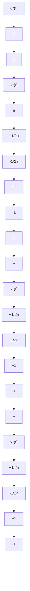

$$
u ^ {*} (t) = \left\{ \begin{array}{l l} - 1, & \text {if} \quad x ^ {*} (t) <   + \frac {1}{2 a} <   0, \\ + 1, & \text {if} \quad x ^ {*} (t) > - \frac {1}{2 a} > 0, \\ - 2 a x ^ {*} (t), & \text {if} \quad x ^ {*} (t) > - \frac {1}{2 a} > 0, \\ - 2 a x ^ {*} (t), & \text {if} \quad x ^ {*} (t) <   + \frac {1}{2 a} <   0, \\ 0, & \text {if} \quad x ^ {*} (t) = 0 \end{array} \right. \tag {7.5.58}
$$

and the implementation of the energy-optimal control law is shown in Figure 7.42.

Further, for a combination of time-optimal and fuel-optimal control systems and other related problems with control constraints, see excellent texts [6, 116].

flowchart

Figure 7.42 Implementation of Energy-Optimal Control Law
