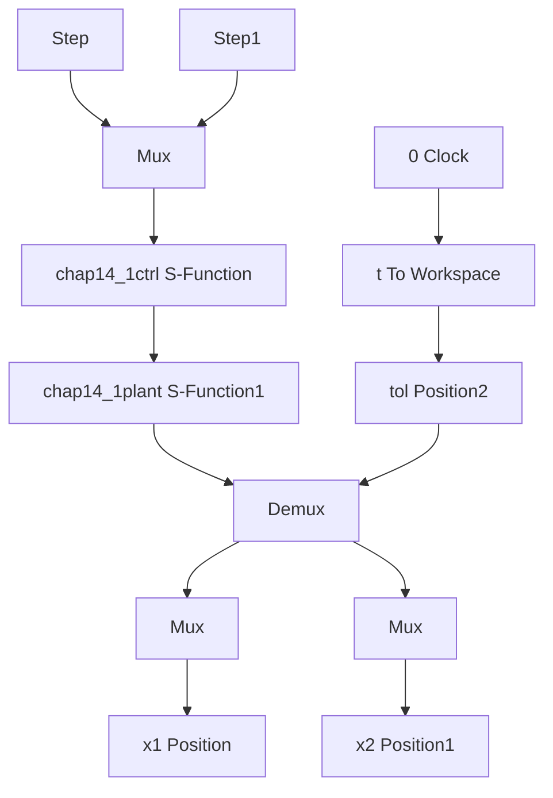

# 〖仿真程序〗

(1) Simulink 主程序: chap14\_1sim.mdl


<details>
<summary>flowchart</summary>


</details>

(2) 控制器子程序: chap14\_1ctrl.m

```matlab
function [sys,x0,str,ts] = spacemodel(t,x,u,flag)

switch flag,
case 0,
    [sys,x0,str,ts]=mdlInitializeSizes;
case 3,
sys=mdlOutputs(t,x,u);
case {2,4,9}
sys=[];
otherwise
error(['Unhandled flag = ',num2str(flag)]);
end

function [sys,x0,str,ts]=mdlInitializeSizes
sizes = simsizes;
sizes.NumOutputs    = 2;
sizes.NumInputs    = 6;
sizes.DirFeedthrough = 1;
sizes.NumSampleTimes = 1;
sys = simsizes(sizes);
x0    = [];
str = [];
ts    = [0 0];

function sys=mdlOutputs(t,x,u)
R1=u(1);dr1=0;
R2=u(2);dr2=0; 
```

```matlab
x(1)=u(3);
x(2)=u(4);
x(3)=u(5);
x(4)=u(6);

e1=R1-x(1);
e2=R2-x(3);
e=[e1;e2];

de1=dr1-x(2);
de2=dr2-x(4);
de=[de1;de2];

Kp=[50 0;0 50];
Kd=[50 0;0 50];

tol=Kp*e+Kd*de;

sys(1)=tol(1);
sys(2)=tol(2); 
```

(3) 被控对象子程序: chap14\_1plant.m  
```matlab
function [sys,x0,str,ts]=s_function(t,x,u,flag)
switch flag,
case 0,
    [sys,x0,str,ts]=mdlInitializeSizes;
case 1,
sys=mdlDerivatives(t,x,u);
case 3,
sys=mdlOutputs(t,x,u);
case {2,4,9}
sys = [];
otherwise
error(['Unhandled flag = ',num2str(flag)]);
end
function [sys,x0,str,ts]=mdlInitializeSizes
global p g
sizes = simsizes;
sizes.NumContStates = 4;
sizes.NumDiscStates = 0;
sizes.NumOutputs = 4;
sizes.NumInputs = 2;
sizes.DirFeedthrough = 0;
sizes.NumSampleTimes = 0;
sys=simsizes(sizes);
x0=[0 0 0 0];
str=[];
ts=[]; 
```

```matlab
p=[2.9 0.76 0.87 3.04 0.87];
g=9.8;
function sys=mdlDerivatives(t,x,u)
global p g
D0=[p(1)+p(2)+2*p(3)*cos(x(3)) p(2)+p(3)*cos(x(3));
p(2)+p(3)*cos(x(3)) p(2)];
C0=[-p(3)*x(4)*sin(x(3)) -p(3)*(x(2)+x(4))*sin(x(3));
p(3)*x(2)*sin(x(3)) 0];
tol=u(1:2);
dq=[x(2);x(4)];
S=inv(D0)*(tol-C0*dq);
sys(1)=x(2);
sys(2)=S(1);
sys(3)=x(4);
sys(4)=S(2);
function sys=mdlOutputs(t,x,u)
sys(1)=x(1);
sys(2)=x(2);
sys(3)=x(3);
sys(4)=x(4); 
```

（4）作图子程序：chap14\_1plot.m

```matlab
closeall;

figure(1);
subplot(211);
plot(t,x1(:,1),'r',t,x1(:,2),'k','linewidth',2);
xlabel('time(s)');ylabel('position tracking of link 1');
subplot(212);
plot(t,x2(:,1),'r',t,x2(:,2),'k','linewidth',2);
xlabel('time(s)');ylabel('position tracking of link 2');

figure(2);
subplot(211);
plot(t,tol(:,1),'k','linewidth',2);
xlabel('time(s)');ylabel('tol1');
subplot(212);
plot(t,tol(:,2),'k','linewidth',2);
xlabel('time(s)');ylabel('tol2'); 
```


