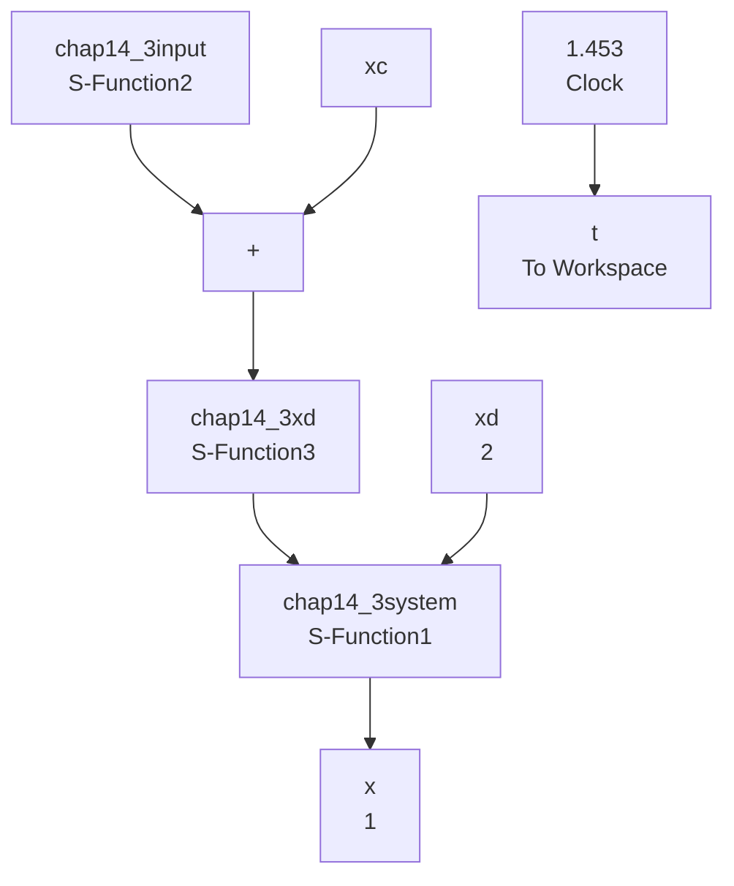

# 〖仿真程序〗

(1) Simulink 主程序: chap14\_3sim.mdl


<details>
<summary>flowchart</summary>


</details>

(2) 输入指令 S 函数: chap14\_3input.m

```matlab
function [sys,x0,str,ts] = spacemodel(t,x,u,flag)
switch flag,
case 0,
    [sys,x0,str,ts]=mdlInitializeSizes;
case 1,
sys=mdlDerivatives(t,x,u);
case 3,
sys=mdlOutputs(t,x,u);
case {2,4,9}
sys=[];
otherwise
error(['Unhandled flag = ',num2str(flag)]);
end
function [sys,x0,str,ts]=mdlInitializeSizes
sizes = simsizes;
sizes.NumContStates = 0; 
```

```matlab
sizes.NumDiscStates = 0;
sizes.NumOutputs = 6;
sizes.NumInputs = 0;
sizes.DirFeedthrough = 1;
sizes.NumSampleTimes = 1;
sys = simsizes(sizes);
x0 = [];
str = [];
ts = [0 0];
function sys=mdlOutputs(t,x,u)
xc1=1-0.2*cos(pi*t);
dxc1=0.2*pi*sin(pi*t);
ddxc1=0.2*pi^2*cos(pi*t);
xc2=1+0.2*sin(pi*t);
dxc2=0.2*pi*cos(pi*t);
ddxc2=-0.2*pi^2*sin(pi*t);
sys(1)=xc1;
sys(2)=dxc1;
sys(3)=ddxc1;
sys(4)=xc2;
sys(5)=dxc2;
sys(6)=ddxc2; 
```  
(3) $x_{d}$ 轨迹生成 S 函数: chap14\_3xd.m

```matlab
function [sys,x0,str,ts]=s_function(t,x,u,flag)
switch flag,
case 0,
    [sys,x0,str,ts]=mdlInitializeSizes;
case 1,
sys=mdlDerivatives(t,x,u);
case 3,
sys=mdlOutputs(t,x,u);
case {2,4,9}
sys = [];
otherwise
error(['Unhandled flag = ',num2str(flag)]);
end
function [sys,x0,str,ts]=mdlInitializeSizes
sizes = simsizes;
sizes.NumContStates = 4;
sizes.NumDiscStates = 0;
sizes.NumOutputs = 8;
sizes.NumInputs = 16;
sizes.DirFeedthrough = 1;
sizes.NumSampleTimes = 0;
sys=simsizes(sizes);
x0=[0.8 0 1.0 0.2*pi]; %xd(0)=xc(0),dxd(0)=dxc(0)
str=[];
ts=[]; 
```

```matlab
function sys=mdlDerivatives(t,x,u)
xc=[1.0-0.2*cos(pi*t) 1.0+0.2*sin(pi*t)]';
dxc=[0.2*pi*sin(pi*t) 0.2*pi*cos(pi*t)]';
ddxc=[0.2*pi^2*cos(pi*t) -0.2*pi^2*sin(pi*t)]';
Mm=[1 0;0 1];
Bm=[10 0;0 10];
Km=[50 0;0 50];

x1=u(7);dx1=u(8);ddx1=u(9);
x2=u(10);dx2=u(11);ddx2=u(12);

xp=[x1 x2]';
dxp=[dx1 dx2]';
ddxp=[ddx1 ddx2]';
if x1>=1.0
xp=[1.0 xp(2)]';dxp=[0 dxp(2)]';ddxp=[0 ddxp(2)]';
end
