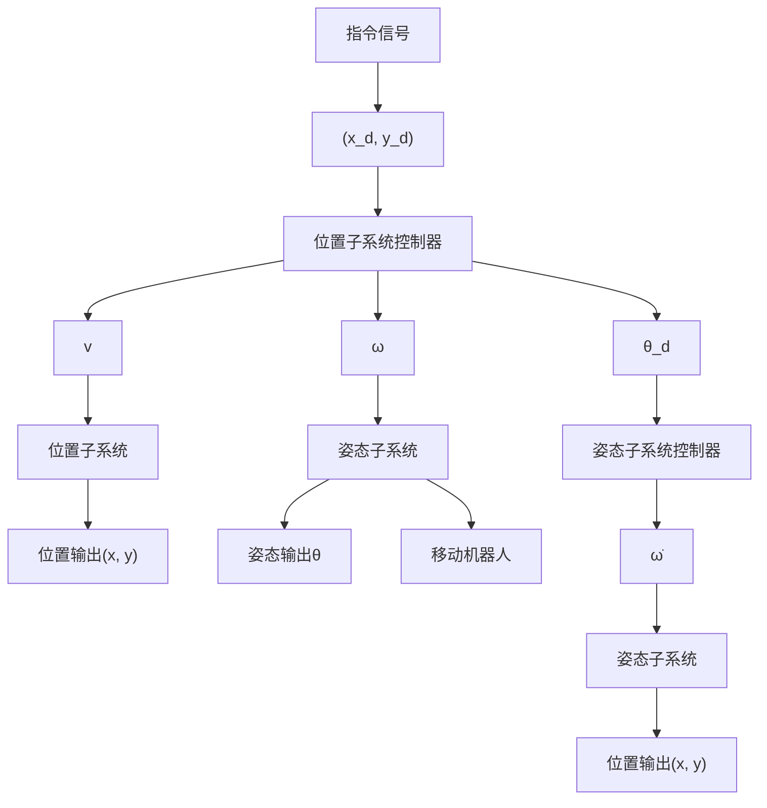

# 14.4.4 闭环系统的设计关键

上述闭环系统属于由内外环构成的控制系统，位置子系统为外环，姿态子系统为内环，外环产生中间指令信号 $\theta_{d}$ ，并传递给内环系统，内环则通过滑模控制律实现对这个中间指令信号的跟踪。具有双环的闭环系统结构如图 14-15 所示。

需要说明的两点如下：

（1）在控制律式（14.27）中，需要对外环产生的中间指令信号 $\theta_{\mathrm{d}}$ 求导，为了简单起见可采用如下线性二阶微分器实现 $\dot{\theta}_{\mathrm{d}}^{[10]}$

flowchart

图 14-15 具有双环的闭环系统结构

$$\dot {x} _ {1} = x _ {2}\dot {x} _ {2} = - 2 R ^ {2} \left(x _ {1} - n (t)\right) - R x _ {2} \tag {14.28}y = x _ {2}$$

式中， $n(t)$ 为待微分的输入信号，取 $n(t)=\theta_{d}$ ； $x_{1}$ 为对信号进行跟踪； $x_{2}$ 为信号一阶导数的估计；微分器的初始值为 $x_{1}(0)=0$ ， $x_{2}(0)=0$ 。

由于该微分器具有积分链式结构，在工程上对含有噪声的信号求导时，噪声只含在微分器的最后一层，通过积分作用信号一阶导数中的噪声能够被更充分地抑制。

（2）在内外环控制中，实际模型中的 $\theta$ 跟踪 $\theta_{d}$ 的动态性能会影响外环的稳定性，从而会影响整个闭环控制系统的稳定性。针对这一问题，文献[11～14]给出了严格的解决方法，其中文献[11]推出了内外环之间的控制增益之间的关系，从而保证了严格的闭环系统稳定性。

为了实现稳定的内环滑模控制，本节介绍的是工程上一般采用的方法，即内环收敛速度大于外环收敛速度的方法，设计较大的控制器增益 $k_{p3}$ 和 $k_{d3}$ ，通过 $\theta$ 快速跟踪 $\theta_{d}$ ，来保证闭环系统的稳定性。

