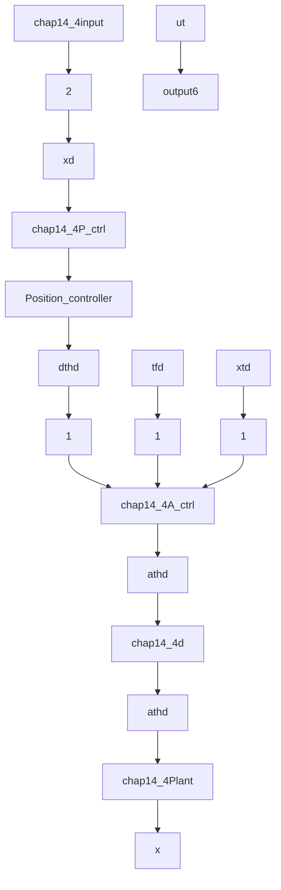

# 〖仿真程序〗

(1) Simulink 主程序: chap14\_4sim.mdl


<details>
<summary>flowchart</summary>


</details>


(2) 指令程序: chap14\_4input.m

```matlab
function [sys,x0,str,ts] = spacemodel(t,x,u,flag)
switch flag,
case 0,
[sys,x0,str,ts]=mdlInitializeSizes;
case 1,
sys=mdlDerivatives(t,x,u);
case 3,
sys=mdlOutputs(t,x,u);
case {2,4,9}
sys=[];
otherwise 
```

```matlab
error(['Unhandled flag = ',num2str(flag)]);
end
function [sys,x0,str,ts]=mdlInitializeSizes
sizes = simsizes;
sizes.NumContStates = 0;
sizes.NumDiscStates = 0;
sizes.NumOutputs = 2;
sizes.NumInputs = 0;
sizes.DirFeedthrough = 1;
sizes.NumSampleTimes = 1;
sys = simsizes(sizes);
x0 = [];
str = [];
ts = [0 0];
function sys=mdlOutputs(t,x,u)
xd=t;
yd=sin(0.5*xd)+0.5*xd+1;
sys(1)=xd;
sys(2)=yd; 
```

(3) 姿态控制器程序: chap14\_4A\_ctrl.m  
```matlab
function [sys,x0,str,ts] = spacemodel(t,x,u,flag)
switch flag,
case 0,
    [sys,x0,str,ts]=mdlInitializeSizes;
case 1,
sys=mdlDerivatives(t,x,u);
case 3,
sys=mdlOutputs(t,x,u);
case {2,4,9}
sys=[];
otherwise
error(['Unhandled flag = ',num2str(flag)]);
end
function [sys,x0,str,ts]=mdlInitializeSizes
sizes = simsizes;
sizes.NumContStates = 0;
sizes.NumDiscStates = 0;
sizes.NumOutputs = 1;
sizes.NumInputs = 5;
sizes.DirFeedthrough = 1;
sizes.NumSampleTimes = 1;
sys = simsizes(sizes);
x0 = [];
str = [];
ts = [0 0];
function sys=mdlOutputs(t,x,u)
dthd=u(1); 
```

```txt
thd=u(2);
th=u(5);
the=th-thd;
kp3=100;
w=dthd-kp3*the;
sys(1)=w; 
```
