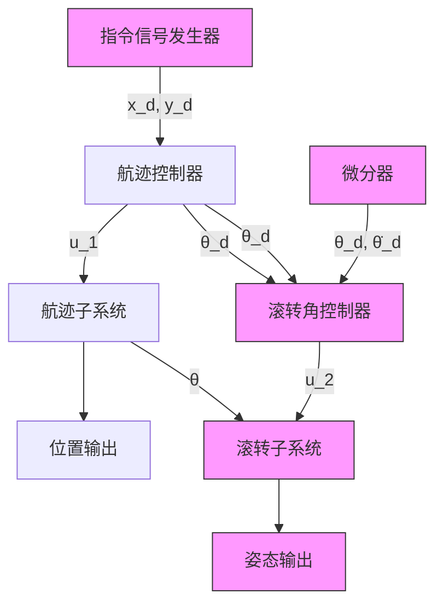

# 15.1.2 针对第一个子系统的控制

针对式（15.3）中的第一个子系统，即航迹跟踪子系统设计控制输入 $u_{1}$ 。

$$
\left. \begin{array}{l} \dot {\tilde {x}} _ {1} = \tilde {x} _ {2} \\ \dot {\tilde {x}} _ {2} = - u _ {1} \sin \theta - \ddot {x} _ {\mathrm{d}} \\ \dot {\tilde {y}} _ {1} = \tilde {y} _ {2} \\ \dot {\tilde {y}} _ {2} = u _ {1} \cos \theta - g - \ddot {y} _ {\mathrm{d}} \end{array} \right\} \tag {15.4}
$$

取 $v_{1} = -u_{1}\sin \theta$ ， $v_{2} = u_{1}\cos \theta$ ，则

$$
\left. \begin{array}{l} \dot {\tilde {x}} _ {1} = \tilde {x} _ {2} \\ \dot {\tilde {x}} _ {2} = v _ {1} - \ddot {x} _ {\mathrm{d}} \\ \dot {\tilde {y}} _ {1} = \tilde {y} _ {2} \\ \dot {\tilde {y}} _ {2} = v _ {2} - g - \ddot {y} _ {\mathrm{d}} \end{array} \right\}
$$

首先针对 x 子系统，设计 PD 控制律为

$$v _ {1} = - k _ {\mathrm{px}} \tilde {x} _ {1} - k _ {\mathrm{dx}} \tilde {x} _ {2} + \ddot {x} _ {\mathrm{d}} \tag {15.5}$$

式中， $k_{px} > 0$ ， $k_{dx} > 0$ ，则 $\ddot{x}_{1} + k_{dx}\dot{\tilde{x}}_{1} + k_{px}\tilde{x}_{1} = 0$ 。按极点配置设计PD参数，取极点为-3.0，则 $k_{px} = 9.0$ ， $k_{dx} = 6.0$ 。

然后针对 y 子系统，取基于前馈补偿的 PD 控制律为

$$v _ {2} = - k _ {\mathrm{py}} \tilde {y} _ {1} - k _ {\mathrm{dy}} \tilde {y} _ {2} + g + \ddot {y} _ {\mathrm{d}} \tag {15.6}$$

式中， $k_{px} > 0$ ， $k_{dx} > 0$ ，则 $\ddot{\tilde{y}}_{1} + k_{dy}\dot{\tilde{y}}_{1} + k_{py}\tilde{y}_{1} = 0$ 。按极点配置设计 PD 参数，取极点为 -3.0，则 $k_{py} = 9.0$ ， $k_{dy} = 6.0$ 。

上述控制器构成了一个外环系统，外环控制器产生角度指令 $\theta_{d}$ ，并传递给内环系统，外环产生的误差 $\theta - \theta_{d}$ 通过内环控制消除。基于双环的控制系统结构如图 15-1 所示。

flowchart

图 15-1 双环控制系统结构

由于与重力方向相比， $u_{1}$ 方向向上，即 $u_{1}$ 取正方向，见式（15.1），故可由式（15.5）和式（15.6）可得控制律为

$$u _ {1} = \sqrt {v _ {1} ^ {2} + v _ {2} ^ {2}} \tag {15.7}\theta_ {\mathrm{d}} = \arctan \left(- \frac {v _ {1}}{v _ {2}}\right) \tag {15.8}$$

上述控制算法实现了外环控制，所产生的 $\theta_{d}$ 作为内环控制指令，通过内环控制实现 $\theta$ 跟踪 $\theta_{d}$ 。内环所产生的 $\theta$ 跟踪 $\theta_{d}$ 的误差会影响闭环系统的稳定性，在双环控制系统中，为了保证整个闭环系统的稳定性，工程上一般采用快速的内环控制算法，即需要 $\theta$ 平稳快速地跟踪 $\theta_{d}$ 。

基于双闭环系统的稳定性分析是一个重要的理论问题，本节只采用工程方法，即内环控制增益大于外环控制增益的方法，使内环响应速度大于外环。针对 $\theta$ 跟踪 $\theta_{\mathrm{d}}$ 误差对闭环系统稳定性影响进行理论分析，这方面的研究成果可见文献[2,3]。

