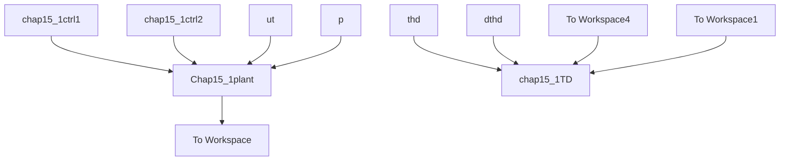

# 〖仿真程序〗

(1) Simulink 主程序: chap15\_1sim.mdl


<details>
<summary>flowchart</summary>


</details>


(2) 航迹跟踪子系统外环控制器 S 函数程序: chap15\_1ctrl1.m  
```matlab
function [sys,x0,str,ts]=s_function(t,x,u,flag)
switch flag,
case 0,
    [sys,x0,str,ts]=mdlInitializeSizes;
case 3,
sys=mdlOutputs(t,x,u);
case {1,2,4,9}
sys = [];
otherwise
error(['Unhandled flag = ',num2str(flag)]);
end
function [sys,x0,str,ts]=mdlInitializeSizes
sizes = simsizes;
sizes.NumDiscStates = 0;
sizes.NumOutputs = 2;
sizes.NumInputs = 6;
sizes.DirFeedthrough = 1;
sizes.NumSampleTimes = 1;
sys=simsizes(sizes);
x0=[];
str=[];
ts=[0 0];
function sys=mdlOutputs(t,x,u)
xd=sin(t);dxd=cos(t);ddxd=-sin(t);
yd=cos(t);dyd=-sin(t);ddyd=-cos(t);
g=9.8;

x1=u(1);x2=u(2);
y1=u(3);y2=u(4);
th=u(5);dth=u(6);

x1e=x1-xd;
x2e=x2-dxd;
y1e=y1-yd;
y2e=y2-dyd;

kpx=9.0;kdx=6.0;
kpy=9.0;kdy=6.0;

v1=-kpx*x1e-kdx*x2e+ddxd;
v2=-kpy*y1e-kdy*y2e+g+ddyd;

u1=sqrt(v1^2+v2^2);
thd=atan(-v1/v2);

sys(1)=u1;
sys(2)=thd; 
```

（3）滚转跟踪子系统内环控制器 S 函数程序：chap15\_1ctrl2.m

```matlab
function [sys,x0,str,ts]=s_function(t,x,u,flag)
switch flag,
case 0,
    [sys,x0,str,ts]=mdlInitializeSizes;
case 3,
sys=mdlOutputs(t,x,u);
case {1,2,4,9}
sys = [];
otherwise
error(['Unhandled flag = ',num2str(flag)]);
end
function [sys,x0,str,ts]=mdlInitializeSizes
sizes = simsizes;
sizes.NumDiscStates = 0;
sizes.NumOutputs = 1;
sizes.NumInputs = 9;
sizes.DirFeedthrough = 1;
sizes.NumSampleTimes = 1;
sys=simsizes(sizes);
x0=[];
str=[];
ts=[0 0];
function sys=mdlOutputs(t,x,u)
g=9.8;

x1=u(1);x2=u(2);
y1=u(3);y2=u(4);
th=u(5);dth=u(6);
thd=u(7);
dthd=u(8);
ddthd=u(9);

e=th-thd;
de=dth-dthd;

kp=25;kd=10;
u2=-kp*e-kd*de+ddthd;

sys(1)=u2; 
```

(4) 微分器 S 函数程序: chap15\_1TD.m

```matlab
function [sys,x0,str,ts] = spacemodel(t,x,u,flag)
switch flag,
case 0,
[sys,x0,str,ts]=mdlInitializeSizes;
case 1,
sys=mdlDerivatives(t,x,u); 
```
