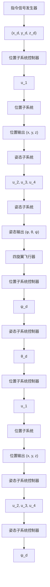

# 15.2.5 闭环系统的设计关键

整个控制系统结构如图 15-7 所示。

flowchart

图 15-7 闭环系统结构

上述闭环系统属于由内外环构成的控制系统，需要采用双环控制方法设计控制律。位置子系统为外环，姿态子系统为内环，外环产生两个中间指令信号 $\psi_{d}$ 和 $\theta_{d}$ ，并传递给内环系统，内环则通过内环控制律实现对这两个中间指令信号的跟踪。

在控制律式（15.21）和式（15.22）中，需要对外环产生的两个中间指令信号 $\psi_{d}$ 和 $\theta_{d}$ 求一次和二次导，可采用如下有限时间收敛三阶微分器实现 $\dot{\psi}_{d}$ 、 $\ddot{\psi}_{d}$ 和 $\dot{\theta}_{d}$ 、 $\ddot{\theta}_{d}^{[4]}$ ：

$$\dot {x} _ {1} = x _ {2}\dot {x} _ {2} = x _ {3}\varepsilon^ {3} \dot {x} _ {3} = - 2 ^ {3 / 5} 4 \left(x _ {1} - v (t) + \left(\varepsilon x _ {2}\right) ^ {9 / 7}\right) ^ {1 / 3} - 4 \left(\varepsilon^ {2} x _ {3}\right) ^ {3 / 5} \tag {15.25}y _ {1} = x _ {2}, y _ {2} = x _ {3}$$

式中， $v(t)$ 为待微分的输入信号； $\varepsilon=0.04$ ； $x_{1}$ 为对信号进行跟踪； $x_{2}$ 为信号一阶导数的估计； $x_{3}$ 为信号二阶导数的估计。微分器的初始值为 $x_{1}(0)=0,\quad x_{2}(0)=0,\quad x_{3}(0)=0$ 。

由于微分器可对非连续函数求导，因此不要求指令信号 $\psi_{d}$ 和 $\theta_{d}$ 连续，从而位置控制律中可以含有切换函数。由于该微分器具有积分链式结构，在工程上对含有噪声的信号求导时，噪声只含在微分器的最后一层，通过积分作用信号一阶导数中的噪声能够被更充分地抑制。

与 15.1 节一样，在内外环控制中，内环的动态性能影响外环的稳定性，从而会影响整个闭环控制系统的稳定性。为了实现收敛速度快的内环控制，采用内环收敛速度大于外环收敛速度的方法，来保证闭环系统的稳定性。在本算法中通过调整内环控制其增益系数，即在姿态控制律的设计中，为了使内环较外环收敛速度快，采用了较大的 PD 增益，保证内环收敛速度大于外环收敛速度。

