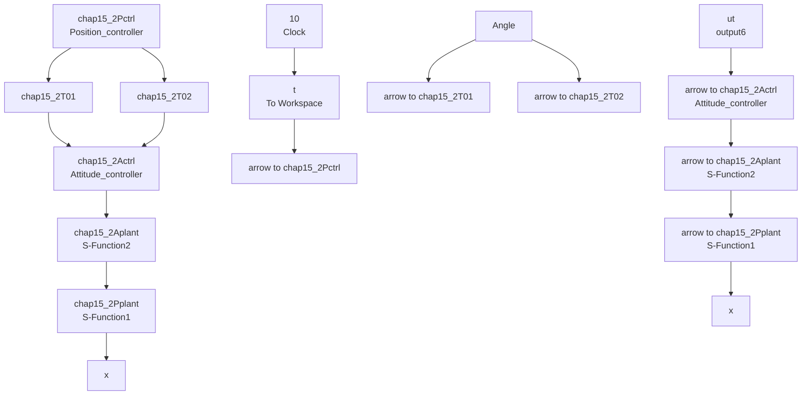

# 〖仿真程序〗

(1) 参数初始化程序: chap15\_2int.m

```matlab
%Parameters Value
m=2;l=0.2;g=9.8;
K1=0.01;K2=0.01;K3=0.01;K4=0.012;K5=0.012;K6=0.012;
I1=1.25;I2=1.25;I3=2.5;

c1=5;c2=5;c3=5;
c4=30;c5=30;c6=30;

k1=5;k2=5;k3=5;
k4=50;k5=50;k6=50;

eta1=0.10;eta2=0.10;eta3=0.10;
eta4=0.10;eta5=0.10;eta6=0.10;

zd=10;phid=pi/3;
%zd=10;phid=0; 
```

(2) Simulink 主程序: chap15\_2sim.mdl


<details>
<summary>flowchart</summary>


</details>

（3）位置子系统被控对象程序：chap15\_2Pplant.m  
```matlab
function [sys,x0,str,ts]=Model(t,x,u,flag)
switch flag,
case 0,
    [sys,x0,str,ts]=mdlInitializeSizes;
case 1,
sys=mdlDerivatives(t,x,u);
case 3,
sys=mdlOutputs(t,x,u);
case {2,4,9}
sys = [];
otherwise
error(['Unhandled flag = ',num2str(flag)]);
end
function [sys,x0,str,ts]=mdlInitializeSizes
sizes = simsizes;
sizes.NumContStates = 6;
sizes.NumDiscStates = 0;
sizes.NumOutputs = 6;
sizes.NumInputs = 7;
sizes.DirFeedthrough = 0;
sizes.NumSampleTimes = 1;
sys=simsizes(sizes);
x0=[2 0 1 0 3 0];
str=[];
ts=[-1 0];
function sys=mdlDerivatives(t,x,u)
u1=u(1);
theta=u(2);
psi=u(4);
phi=u(6);

chap15_2int;

x1=x(1);dx1=x(2);
y=x(3);dy=x(4);
z=x(5);dz=x(6);

ddx=u1*(cos(phi)*sin(theta)*cos(psi)+sin(phi)*sin(psi))-K1*dx1/m;
ddy=u1*(sin(phi)*sin(theta)*cos(psi)-cos(psi)*sin(psi))-K2*dy/m;
ddz=u1*(cos(phi)*cos(psi))-g-K3*dz/m;

sys(1)=x(2);
sys(2)=ddx;
sys(3)=x(4);
sys(4)=ddy;
sys(5)=x(6);
sys(6)=ddz; 
```

```matlab
function sys=mdlOutputs(t,x,u)
x1=x(1);dx1=x(2);
y=x(3);dy=x(4);
z=x(5);dz=x(6);

sys(1)=x1;
sys(2)=dx1;
sys(3)=y;
sys(4)=dy;
sys(5)=z;
sys(6)=dz; 
```
