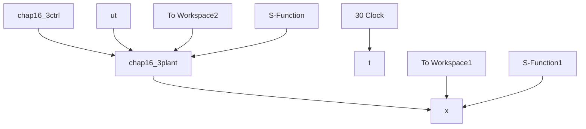

# (1) 增益求解仿真

① Riccati 控制器增益求解程序：chap16\_2riccati.m

```matlab
clearall;
closeall;
%Single Link Inverted Pendulum Parameters
g=9.8;M=1.0;
%M=0.1;
m=0.1;L=0.5;
I=1/12*m*L^2;
l=1/2*L;
t1=m*(M+m)*g*l/[(M+m)*I+M*m*l^2];
t2=-m^2*g*l^2/[(m+M)*I+M*m*l^2];
t3=-m*l/[(M+m)*I+M*m*l^2];
t4=(I+m*l^2)/[(m+M)*I+M*m*l^2];

A=[0,0,1,0;
0,0,0,1;
t1,0,0,0;
t2,0,0,0];
B2=[0;0;t3;t4];
B1=[0;0;0.1;0.1];
%%%,%,%,%,%,%,%,%,%,%,%,%,%,%,%,%,%,%,%,%,%,%,%,%,%,%,%,%,%,%%,q1=1;q2=1;
q3=1;q4=1;
rho=1;

C1=[sqrt(q1), 0, 0, 0; 
```

```matlab
0, sqrt(q2), 0, 0;
0, 0, sqrt(q3), 0;
0, 0, 0, sqrt(q4);
0, 0, 0, 0];
D12=[0;0;0;0;sqrt(rho)];
%Continuous-time algebraic Riccati equation: Help-->search-->care
B=[B1 B2];
R=[-1 0;0 1];
C=C1;
X=care(A,B,C'*C,R)
%Verify the stability of A+(B1*B1'-B2*B2')*X
eig(A+(B1*B1'-B2*B2')*X)
K=-B2'*X 
```

② LMI 的控制器增益求解程序：chap16\_2LMI.m

```matlab
% H Infinity Controller Design based on LMI for Single Link Inverted Pendulum
clearall;
closeall;

%Single Link Inverted Pendulum Parameters
g=9.8;M=1.0;m=0.1;L=0.5;
I=1/12*m*L^2;
l=1/2*L;
t1=m*(M+m)*g*l/[(M+m)*I+M*m*l^2];
t2=-m^2*g*l^2/[(m+M)*I+M*m*l^2];
t3=-m*l/[(M+m)*I+M*m*l^2];
t4=(I+m*l^2)/[(m+M)*I+M*m*l^2];

A=[0,0,1,0;
0,0,0,1;
t1,0,0,0;
t2,0,0,0];
B2=[0;0;t3;t4];
B1=[0;0;1;1];
%%%,%,%,%,%,%,%,%,%,%,%,%,%,%,%,%,%,%,%,%,%,%,%,%,%,%,%,%%,q1=1;q2=1;q3=1;q4=1;
q=[q1,q2,q3,q4];
gama=100;

C1=[diag(q);zeros(1,4)];
rho=1;
D12=[0;0;0;0;rho]; 
```

```matlab
D11=zeros(5,1);
%%%%
P1=sdpvar(4,4);
P2=sdpvar(1,4);

FAI=[A*P1+P1*A'+B2*P2+P2'*B2'+1/gama^2*B1*B1'(C1*P1+D12*P2)';
C1*P1+D12*P2-eye(5)];

%LMI description
L1=set(P1>0);
L2=set(FAI<0);
LL=L1+L2;

solvesdp(LL);

P1=double(P1);
P2=double(P2);

K=P2*inv(P1) 
```

(2) 控制系统仿真

① Simulink 主程序: chap16\_3sim.mdl


<details>
<summary>flowchart</summary>


</details>

② 被控对象子程序：chap16\_3plant.m
