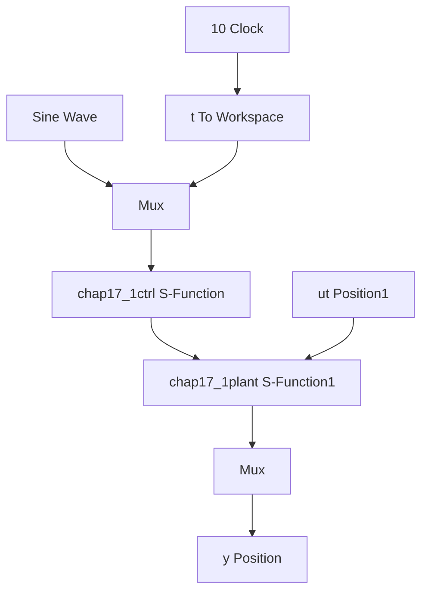

# 〖仿真程序〗

(1) Simulink 主程序: chap17\_1sim.mdl


<details>
<summary>flowchart</summary>


</details>

(2) 控制器 S 函数: chap17\_1ctrl.m

```matlab
switch flag,
case 0,
    [sys,x0,str,ts]=mdlInitializeSizes;
case 3,
    sys=mdlOutputs(t,x,u);
case {1,2,4,9}
    sys=[];
otherwise
    error(['Unhandled flag = ',num2str(flag)]);
end

function [sys,x0,str,ts]=mdlInitializeSizes
sizes = simsizes;
sizes.NumContStates = 0;
sizes.NumDiscStates = 0;
sizes.NumOutputs = 1;
sizes.NumInputs = 3;
sizes.DirFeedthrough = 1;
sizes.NumSampleTimes = 0;
sys = simsizes(sizes);
x0 = [];
str = [];
ts = [];
function sys=mdlOutputs(t,x,u)
xd=0.1*sin(t);
dxd=0.1*cos(t);
x1=u(2);
x2=u(3);

e=xd-x1;
de=dxd-x2;

%PD Control
kp=1000;kd=100;
ut=kp*e+kd*de;
sys(1)=ut; 
```

(3) 被控对象 S 函数: chap17\_1plant.m

```matlab
function [sys,x0,str,ts]=s_function(t,x,u,flag)
switch flag,
case 0,
[sys,x0,str,ts]=mdlInitializeSizes;
case 1,
sys=mdlDerivatives(t,x,u);
case 3, 
```

```matlab
sys=mdlOutputs(t,x,u);
case {2,4,9}
    sys = [];
otherwise
    error(['Unhandled flag = ',num2str(flag)]);
end
function [sys,x0,str,ts]=mdlInitializeSizes
sizes = simsizes;
sizes.NumContStates = 2;
sizes.NumDiscStates = 0;
sizes.NumOutputs = 2;
sizes.NumInputs = 1;
sizes.DirFeedthrough = 0;
sizes.NumSampleTimes = 0;
sys=simsizes(sizes);
x0=[pi/60 0];
str=[];
ts=[];
function sys=mdlDerivatives(t,x,u)
g=9.8;mc=1.0;m=0.1;l=0.5;
S=l*(4/3-m*(cos(x(1)))^2/(mc+m));
fx=g*sin(x(1))-m*l*x(2)^2*cos(x(1))*sin(x(1))/(mc+m);
fx=fx/S;
gx=cos(x(1))/(mc+m);
gx=gx/S;

sys(1)=x(2);
sys(2)=fx+gx*u;
function sys=mdlOutputs(t,x,u)
sys(1)=x(1);
sys(2)=x(2); 
```
