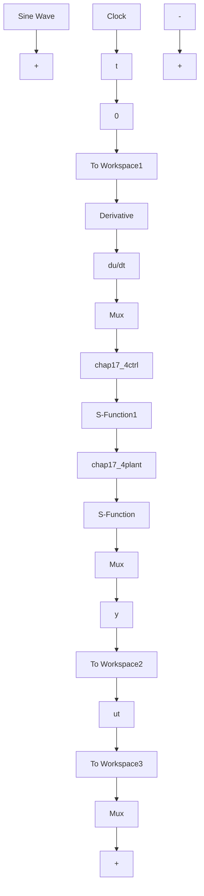

# 〖仿真程序〗

(1) Simulink 主程序: chap17\_4sim.mdl


<details>
<summary>flowchart</summary>


</details>

(2) 控制器子程序: chap17\_4ctrl.m  
```matlab
function [sys,x0,str,ts]=obser(t,x,u,flag)
switch flag,
case 0,
    [sys,x0,str,ts]=mdlInitializeSizes;
case 1,
    sys=mdlDerivatives(t,x,u);
case 3,
    sys=mdlOutputs(t,x,u);
case {1,2,4,9}
    sys = [];
otherwise
    error(['Unhandled flag = ',num2str(flag)]);
end
function [sys,x0,str,ts]=mdlInitializeSizes
sizes = simsizes;
sizes.NumDiscStates = 0;
sizes.NumOutputs = 1;
sizes.NumInputs = 6;
sizes.DirFeedthrough = 1;
sizes.NumSampleTimes = 0;
sys=simsizes(sizes);
x0=[];
str=[];
ts=[];
function sys=mdlOutputs(t,x,u)
yd=u(1);
dyd=cos(t);
ddyd=-sin(t);
e=u(2);
de=u(3);
x1=u(4);
x2=u(5);
x3=u(6);

f=(x1^5+x3)*(x3+cos(x2))+(x2+1)*x1^2;

M=2;
if M==1
    k1=10;k2=10;
    v=ddyd+k1*e+k2*de;
    ut=1.0/(x2+1)*(v-f);
elseif M==2
    ut=150*e+30*de; %PD
end
sys(1)=ut; 
```

（3）被控对象子程序：chap17\_4plant.m  
```matlab
function [sys,x0,str,ts]=obser(t,x,u,flag)
switch flag,
case 0,
[sys,x0,str,ts]=mdlInitializeSizes; 
```

```matlab
case 1,
    sys=mdlDerivatives(t,x,u);
case 3,
    sys=mdlOutputs(t,x,u);
case {2,4,9}
    sys = [];
otherwise
    error(['Unhandled flag = ',num2str(flag)]);
end
function [sys,x0,str,ts]=mdlInitializeSizes
sizes = simsizes;
sizes.NumContStates = 3;
sizes.NumDiscStates = 0;
sizes.NumOutputs = 3;
sizes.NumInputs = 1;
sizes.DirFeedthrough = 1;
sizes.NumSampleTimes = 0;
sys=simsizes(sizes);
x0=[0.15 0 0];
str=[];
ts=[];
function sys=mdlDerivatives(t,x,u)
ut=u(1);
sys(1)=sin(x(2))+(x(2)+1)*x(3);
sys(2)=x(1)^5+x(3);
sys(3)=x(1)^2+ut;
function sys=mdlOutputs(t,x,u)
sys(1)=x(1);
sys(2)=x(2);
sys(3)=x(3); 
```

（4）作图程序：chap17\_4plot.m

close all;

figure(1);

```matlab
subplot(211);
plot(t,y(:,1),'r',t,y(:,2),'k:','linewidth',2);
xlabel('time');ylabel('position tracking');
legend('ideal position signal','position tracking');
subplot(212);
plot(t,y(:,1)-y(:,2),'r','linewidth',2);
xlabel('time');ylabel('position tracking error');
figure(2);
plot(t,ut(:,1),'r','linewidth',2);
xlabel('time');ylabel('control input'); 
```


