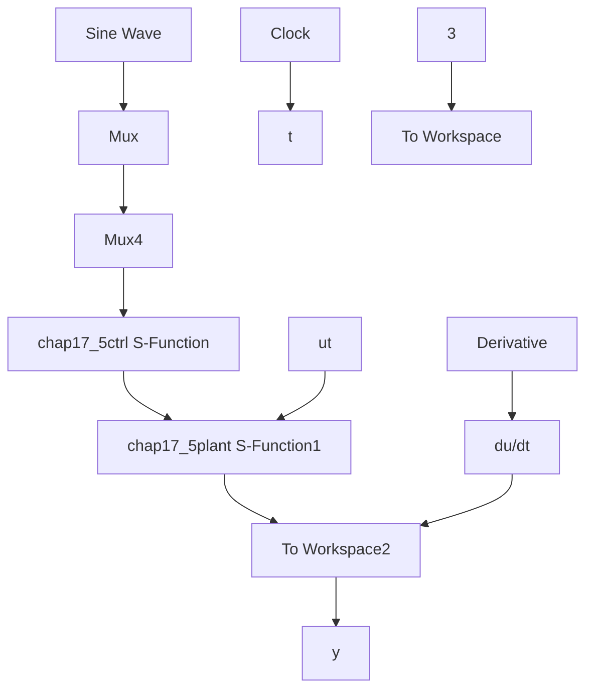

# 〖仿真程序〗

(1) Simulink 主程序: chap17\_5sim.mdl


<details>
<summary>flowchart</summary>


</details>

(2) 控制器 S 函数子程序: chap17\_5ctrl.m

```matlab
function [sys,x0,str,ts] = spacemodel(t,x,u,flag)

switch flag,
case 0,
    [sys,x0,str,ts]=mdlInitializeSizes;
case 3,
    sys=mdlOutputs(t,x,u);
case {2,4,9}
    sys=[];
otherwise
    error(['Unhandled flag = ',num2str(flag)]);
end

function [sys,x0,str,ts]=mdlInitializeSizes
global M V x0 fai

sizes = simsizes;
sizes.NumDiscStates = 0;
sizes.NumOutputs = 1;
sizes.NumInputs = 3;
sizes.DirFeedthrough = 1;
sizes.NumSampleTimes = 1;
sys = simsizes(sizes);
x0=[];
str = [];
ts = [0 0];
function sys=mdlOutputs(t,x,u)
c1=35;
c2=15;

yd=u(1);
dyd=0.1*pi*cos(pi*t);
ddyd=-0.1*pi^2*sin(pi*t);
x1=u(2); 
```

```matlab
x2=u(3);
g=9.8;mc=1.0;m=0.1;l=0.5;
S=l*(4/3-m*(cos(x1))^2/(mc+m));
fx=g*sin(x1)-m*l*x2^2*cos(x1)*sin(x1)/(mc+m);
fx=fx/S;
gx=cos(x1)/(mc+m);
gx=gx/S;

e1=x1-yd;
de1=x2-dyd;

s=x2+c1*e1-dyd;
xite=0.010;
ut=(1/gx)*(-fx-c2*s-e1-c1*de1+ddyd-xite*sign(s));

sys(1)=ut; 
```

（3）被控对象子程序：chap17\_5plant.m  
```matlab
function [sys,x0,str,ts]=s_function(t,x,u,flag)
switch flag,
case 0,
    [sys,x0,str,ts]=mdlInitializeSizes;
case 1,
    sys=mdlDerivatives(t,x,u);
case 3,
    sys=mdlOutputs(t,x,u);
case {2,4,9}
    sys = [];
otherwise
    error(['Unhandled flag = ',num2str(flag)]);
end
function [sys,x0,str,ts]=mdlInitializeSizes
sizes = simsizes;
sizes.NumContStates = 2;
sizes.NumDiscStates = 0;
sizes.NumOutputs = 2;
sizes.NumInputs = 1;
sizes.DirFeedthrough = 0;
sizes.NumSampleTimes = 0;
sys=simsizes(sizes);
x0=[pi/60 0];
str=[];
ts=[];
function sys=mdlDerivatives(t,x,u)
g=9.8;mc=1.0;m=0.1;l=0.5;

S=l*(4/3-m*(cos(x(1)))^2/(mc+m));
fx=g*sin(x(1))-m*l*x(2)^2*cos(x(1))*sin(x(1))/(mc+m);
fx=fx/S;
gx=cos(x(1))/(mc+m);
gx=gx/S; 
```

```matlab
sys(1)=x(2);
sys(2)=fx+gx*u;
function sys=mdlOutputs(t,x,u)
sys(1)=x(1);
sys(2)=x(2); 
```

（4）作图程序：chap17\_5plot.m

```matlab
close all;
figure(1);
subplot(211);
plot(t,y(:,1),'r',t,y(:,3),'k:','linewidth',2);
xlabel('time(s)');ylabel('Position tracking');
legend('ideal position signal','position tracking');
subplot(212);
plot(t,y(:,2),'r',t,y(:,4),'k:','linewidth',2);
xlabel('time(s)');ylabel('Speed tracking');
legend('ideal speed signal','speed tracking');
figure(2);
plot(t,ut(:,1),'r','linewidth',2);
xlabel('time(s)');ylabel('Control input'); 
```


