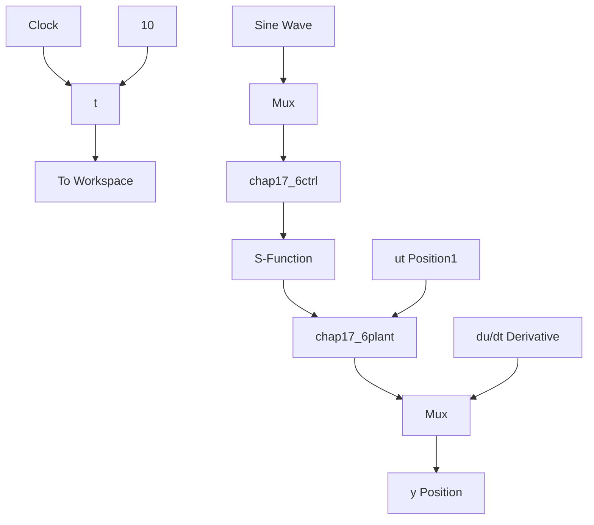

# 〖仿真程序〗

(1) Simulink 主程序: chap17\_6sim.mdl


<details>
<summary>flowchart</summary>


</details>

(2) 控制器 S 函数: chap17\_6ctrl.m

```matlab
function [sys,x0,str,ts] = spacemodel(t,x,u,flag)
switch flag,
case 0,
    [sys,x0,str,ts]=mdlInitializeSizes;
case 3,
    sys=mdlOutputs(t,x,u);
case {1,2,4,9}
    sys=[];
otherwise
    error(['Unhandled flag = ',num2str(flag)]);
end
function [sys,x0,str,ts]=mdlInitializeSizes
sizes = simsizes;
sizes.NumContStates = 0; 
```

```matlab
sizes.NumDiscStates = 0;
sizes.NumOutputs = 1;
sizes.NumInputs = 3;
sizes.DirFeedthrough = 1;
sizes.NumSampleTimes = 0;
sys = simsizes(sizes);
x0 = [];
str = [];
ts = [];
function sys=mdlOutputs(t,x,u)
thd=0.1*sin(t);
dthd=0.1*cos(t);
ddthd=-0.1*sin(t);

x1=u(2);
x2=u(3);
e=thd-x1;
de=dthd-x2;

c=15;
s=c*e+de;

g=9.8;mc=1.0;m=0.1;l=0.5;
T=1*(4/3-m*(cos(x1))^2/(mc+m));

fx=g*sin(x1)-m*l*x2^2*cos(x1)*sin(x1)/(mc+m);
fx=fx/T;
gx=cos(x1)/(mc+m);
gx=gx/T;
xite=0.20;

M=2;
if M==1
    ut=1/gx*(-fx+ddthd+c*de+xite*sign(s));
elseif M==2 %Saturated function
    delta=0.05;
    kk=1/delta;
    if abs(s)>delta
    sats=sign(s);
    else
    sats=kk*s;
    end
    ut=1/gx*(-fx+ddthd+c*de+xite*sats);
end

sys(1)=ut; 
```

(3) 被控对象 S 函数: chap17\_6plant.m

```txt
function [sys,x0,str,ts]=s_function(t,x,u,flag)
switch flag, 
```
