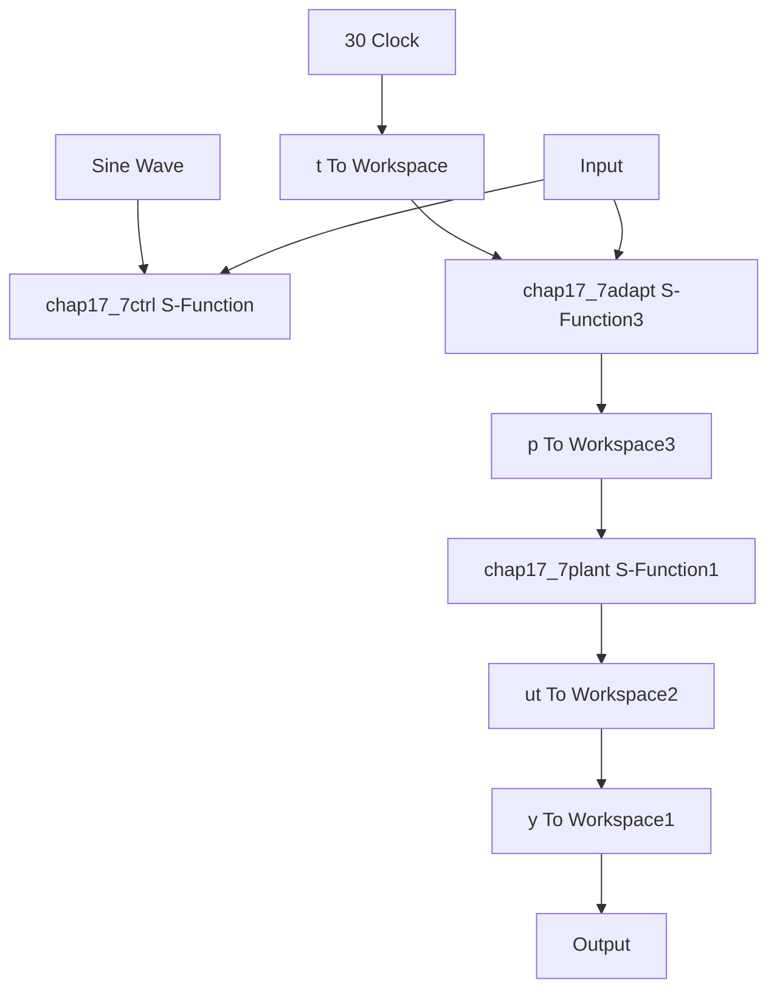

# 〖仿真程序〗

(1) Simulink 主程序: chap17\_7sim.mdl


<details>
<summary>flowchart</summary>


</details>

(2) 控制律 S 函数程序: chap17\_7ctrl.m  
```matlab
function [sys,x0,str,ts]=s_function(t,x,u,flag)
switch flag,
case 0,
    [sys,x0,str,ts]=mdlInitializeSizes;
case 3,
    sys=mdlOutputs(t,x,u);
case {1,2,4,9}
    sys = [];
otherwise
    error(['Unhandled flag = ',num2str(flag)]);
end
function [sys,x0,str,ts]=mdlInitializeSizes
sizes = simsizes;
sizes.NumContStates = 0;
sizes.NumDiscStates = 0;
sizes.NumOutputs = 1;
sizes.NumInputs = 5;
sizes.DirFeedthrough = 1;
sizes.NumSampleTimes = 1;
sys=simsizes(sizes);
x0=[];
str=[];
ts=[0 0];
function sys=mdlOutputs(t,x,u)
xd=u(1);
dxd=cos(t);
ddxd=-sin(t);
x1=u(2);
x2=u(3);
e=x1-xd;
de=x2-dxd;

thp=u(5);

c=15;
s=de+c*e; %Sliding Mode
dq=ddxd-c*de;

ks=15;
xite=2.01;
ua=thp*dq;
us1=-ks*s;
us2=-xite*sign(s);

M=1;
if M==1 %DRC
    ut=ua+us1+us2;
elseif M==2 %PD
    kp=100;kd=50; 
```

```javascript
ut=-kp*e-kd*de;
end
sys(1)=ut; 
```

（3）自适应律 S 函数程序：chap17\_7adapt.m  
```matlab
function [sys,x0,str,ts]=s_function(t,x,u,flag)
switch flag;
case 0,
    [sys,x0,str,ts]=mdlInitializeSizes;
case 1,
    sys=mdlDerivatives(t,x,u);
case 3,
    sys=mdlOutputs(t,x,u);
case {2,4,9}
    sys = [];
otherwise
    error(['Unhandled flag = ',num2str(flag)]);
end

function [sys,x0,str,ts]=mdlInitializeSizes
sizes = simsizes;
sizes.NumContStates = 1;
sizes.NumDiscStates = 0;
sizes.NumOutputs = 1;
sizes.NumInputs = 4;
sizes.DirFeedthrough = 1;
sizes.NumSampleTimes = 0;
sys=simsizes(sizes);
x0=[0];
str=[];
ts=[];
function sys=mdlDerivatives(t,x,u)
xd=u(1);
dxd=cos(t);
ddxd=-sin(t);
x1=u(2);
x2=u(3);

e=x1-xd;
de=x2-dxd;

c=15;
gama=500;

s=de+c*e;
thp=x(1);
dq=ddxd-c*de;

th_min=0.5;
th_max=1.5; 
```

```matlab
alaw=-gama*dq*s; %Adaptive law
N=2;
if N==1
    sys(1)=alaw;
elseif N==2
    if thp>=th_max&alaw>0
    sys(1)=0;
    elseif thp<=th_min&alaw<0
    sys(1)=0;
    else
    sys(1)=alaw;
    end
end
function sys=mdlOutputs(t,x,u)
sys(1)=x(1); %J estimate 
```
