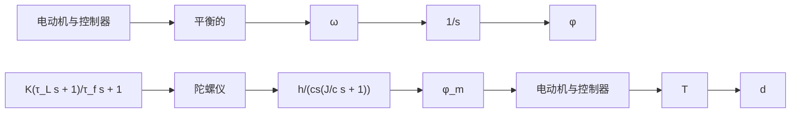

# 9.4节习题

9.10 计算如图 9.6c 所示的死区非线性继电器的描述函数。  
9.11 计算如图 9.6d 所示的死区非线性增益的描述函数。  
9.12 计算如图 9.6e 所示预加载弹簧或库仑加上黏性摩擦的非线性项的描述函数。  
9.13 考虑如图 9.62 所示阶梯状的量化函数。为此非线性函数找到描述函数，并写出 matlab.m 函数来生成它。

line

| u | y |
| --- | --- |
| δ₁ | 0 |
| δ₂ | 2 |
| δ₃ | 3 |
| δ₄ | 4 |

图 9.62 习题 9.13 的量化非线性函数

9.14 推导出如图 9.63 所示的理想触点控制器的描述函数。判断其是否依赖于频率？如果它有时间延迟或磁滞，是否会依赖频率？为几个不同幅度的输入绘制输出曲线，并确定那些输入的描述函数的值。

line

| 输入 | 输出 |
| --- | --- |
| O | 0 |
| d | 1 |

图 9.63 习题 9.14 的触点器图

9.15 惯性平台的触点控制器如图 9.64 所示，其中

$$
\begin{array}{l} I = 0. 1 \mathrm{kg} \cdot \mathrm{m} ^ {2} \\ \frac {I}{B} = 1 0 \mathrm{s} \\ \end{array}
$$

flowchart

图 9.64 习题 9.15 系统框图

$$
\begin{array}{l} \frac {h}{c} = 1 \\ \frac {J}{c} = 0. 0 1 \mathrm{s} \\ \tau_ {\mathrm{L}} = 0. 1 \mathrm{s} \\ \tau_ {\mathrm{f}} = 0. 0 1 \mathrm{s} \\ \end{array}
d = 1 0 ^ {- 5} \mathrm{rad}T = 1 \mathrm{N} \cdot \mathrm{m}
$$

需要的稳定解大约是 $10^{-6}$ rad: 当 $\varphi_{m} > 10^{-6}$ rad 时，有 $K\varphi_{m} > d$

判断极限环是否存在，若存在，则使用增益 K 和控制器的描述函数组成的函数来表示其幅值和频率。对带有磁滞的死区特性重复这些讨论。

9.16 非线性 J. C. 克莱格 (Clegg) 积分：多年来，已经有一些尝试想要完善线性积分器。线性积分器具有在所有频率处相位滞后的缺点。1958 年，克莱格提出修改线性积分器，使得每当对积分器的输入经过 0（就是说改变符号时），就将状态重置到 0。该克莱格积分器具有这样的性质：当它的输入和输出具有相同符号时，它就像一个线性积分器。否则，重置输出为零。克莱格积分器可描述为

$$x (t) = e (t), \quad \text {如果} e (t) \neq 0x (t +) = 0, \quad \text {如果} e (t) = 0$$

其中后一个方程式意味着积分器的状态 x 在 e 改变符号后立刻重置为 0。它可用运算放大器和二极管来实现。克莱格积分的一个潜在缺点是它可能引起振荡。

(a) 如果输入是 $e = a \sin(\omega t)$ ，绘出克莱格积分器的输出。

(b) 证明克莱格积分器的 DF 是

$$N (a, \omega) = \frac {4}{\pi \omega} - j \frac {1}{\omega}$$

且这只有 $38^{\circ}$ 的相位滞后。
