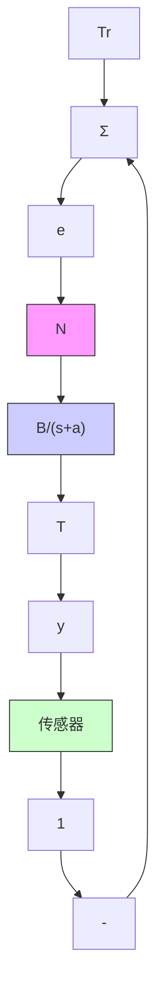

# △ 9.5 节习题

9.17 计算并绘出最优的反转曲线与最小时间控制系统的最优控制，系统方程为

$$\dot {x} _ {1} = x _ {2}\dot {x} _ {2} = - x _ {2} + u| u | \leqslant 1$$

使用逆时间方法并消除时间。

9.18 对 $|u|\leqslant 1$ 的最小时间线性控制系统

$$\dot {x} _ {1} = x _ {2}\dot {x} _ {2} = - 2 x _ {1} - 3 x _ {2} + u$$

绘出最优的反转曲线。

9.19 对系统

$$\dot {x} _ {1} = x _ {2}\dot {x} _ {2} = - x _ {1} + u| u | \leqslant 1$$

绘出时间最优控制律，并画出 $x_{1}(0)=3$ ， $x_{2}(0)=0$ 时的轨迹。

9.20 考虑如图 9.65 所示的热控制系统。物理系统可以是一个房间，炉子等等。

(a) 极限环周期是多少?

(b) 如果 $T_{r}$ 是一个缓慢递增的函数，绘出系统的输出 T，写出 $T_{r}$ “很大”时的解。

flowchart

图 9.65 习题 9.20 的热控制系统

9.21 几个系统，如航天器，谐振频率远低于切换频率的弹簧系统，和由电机驱动的摩擦力非常小的大负载可被建模为一个惯性系统。对于一个理想的切换曲线，画出系统的相图。切换函数为 $e = \theta + \tau \omega$ 。假设 $\tau = 10 s$ ，控制信号频率为 $10^{-3} rad/s^{2}$ 。绘出如下情况的结果。

(a) 死区。  
(b) 带有磁滞的死区。

(c) 具有时滞 T 的死区。  
(d) 带有常数扰动的死区。

9.22 用输入信号

$$u = - \operatorname{sgn} (\tau \dot {\theta} + \theta)$$

对带有延迟

$$I \ddot {\theta} = N u (t - \Delta)$$

的卫星进行姿态控制，计算极限环的幅值。画出极限环的相平面轨迹和 $\theta$ 的最大值随时间的变化曲线。

9.23 考虑零摩擦质点单摆，如图 9.66 所示。以等值线方法为指导，画出其运动的相平面图像。特别要注意 $\theta=\pi$ 的附近。表明解对应的是摆锤一圈一圈地旋转，而不是来回振荡的。

text_image

M
θ
l

图9.66 习题9.23中的摆

9.24 画出系统

$$\ddot {x} = 1 0 ^ {- 6} \mathrm{m} / \mathrm{s} ^ {2}$$

在 $\dot{x}(0)=0,\quad x(0)=0$ 与 $x(t)=1\mathrm{mm}$ 之间的相轨迹。通过比较使用不同间隔值所得的解和精确解，用图形法从抛物线上求出过渡时间 $t_{f}$ 。

9.25 考虑具有下式运动方程的系统

$$\ddot {\theta} + \dot {\theta} + \sin \theta = 0$$

(a) 这对应什么物理系统？  
(b) 画出系统的相位图。  
(c) 计算 $\theta(0)=0.5\mathrm{rad}$ ， $\dot{\theta}=0$ 时的具体解。

9.26 考虑非线性直立摆，在基座用电动机作为其执行器。设计一个反馈控制器镇定该系统。

9.27 考虑系统

$$\dot {x} = - \sin x$$

证明原点是渐近稳定的平衡点。

9.28 一个由方程 $\dot{x} = -f(x)$ 描述的一阶非线性系统，其中： $f(x)$ 是连续可微的非线性函数，满足以下条件：

$$
\begin{array}{l} f (0) = 0 \\ f (x) > 0, \quad x > 0 \\ f (x) <   0, \quad x <   0 \\ \end{array}
$$

利用李雅普诺夫函数 $V(x)=x^{2}/2$ 证明在原点 $(x=0)$ 附近系统是稳定的。

9.29 利用李雅普诺夫方程：

$$\boldsymbol {A} ^ {\mathrm{T}} \boldsymbol {P} + \boldsymbol {P A} = - Q = - I$$

找到使图9.67所示的系统稳定的 $K$ 的范围。利用劳斯稳定判据求取 $K$ 的稳定值，并对两者进行对比。
