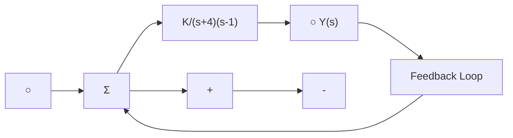

flowchart

图 9.67 习题 9.29 的控制系统

9.30 考虑系统

$$
\frac {\mathrm{d}}{\mathrm{d} t} \left[ \begin{array}{l} x _ {1} \\ x _ {2} \end{array} \right] = \left[ \begin{array}{l} x _ {1} + x _ {2} u \\ x _ {2} (x _ {2} + u) \end{array} \right], \quad y = x _ {1}
$$

找到所有 $\alpha$ 、 $\beta$ 值，使得输入 $u(t)=\alpha y(t)+\beta$ 能将输出 $y(t)$ 保持在 1 附近。

9.31 考虑非线性自治系统：

$$
\frac {\mathrm{d}}{\mathrm{d} t} \left[ \begin{array}{l} x _ {1} \\ x _ {2} \\ x _ {3} \end{array} \right] = \left[ \begin{array}{l} x _ {2} (x _ {3} - x _ {1}) \\ x _ {1} ^ {2} - 1 \\ - x _ {1} x _ {3} \end{array} \right]
$$

(a) 找到平衡点(多个)。  
(b) 对于每个平衡点，找到线性化后的系统。  
(c) 对于(b)问中的每种情况，利用李雅普诺夫理论判定非线性系统在平衡点附近的稳定性。

9.32 考虑图 9.68 所示的电路。对于什么样的二极管特性这个系统是稳定的？

text_image

iC
C
L
iL
iC
+
V
-

图9.68 习题9.32的电路图

9.33 范·德尔·波尔(Van der Pol)方程：考虑由如下非线性微分方程所描述的系统

$$\ddot {x} + \varepsilon (1 + x ^ {2}) \dot {x} + x = 0$$

其中常数 $\varepsilon > 0$ 。

(a) 证明此方程可以写为如下形式[利纳德(Liénard)或者 $(x, y)$ 平面]

$$
\begin{array}{l} \dot {x} = y + \varepsilon \left(\frac {x ^ {3}}{3} - x\right) \\ \dot {y} = - x \\ \end{array}
$$

(b) 利用李雅普诺夫函数 $V=\frac{1}{2}(x^{2}+\dot{x}^{2})$ ，
在利纳德平面绘出由此 V 确定的稳定区域。  
(c) 画出(b)问的轨迹，并找出使其靠近原点的初始条件。用不同的初始条件 x (0) 和 $\dot{x}(0)$ 在 Simulink 中仿真系统。

考虑 $\varepsilon = 0.5$ 和 $\varepsilon = 1.0$ 这两种情况。

9.34 杜芬(Duffing)方程：考虑由如下非线性微分方程描述的系统，

$$\ddot {x} + k \dot {x} + \varepsilon x ^ {3} = u$$

其中： $u=A\cos(t)$ 。这个方程表示一个硬弹簧模型，其中，k 是弹簧劲度系数，如果 $\varepsilon>0$ ，弹簧会随着位移的增加而变坚硬。令 k=0.05， $\varepsilon=1$ ，且 A=7.5。

(a) 在 Simulink 中建立此系统的模拟系统。证明该系统的响应对初始条件 $x(0)$ ， $\dot{x}(0)$ 的轻微摄动非常敏感（该系统称为混沌的）。当 t=30s，模拟系统在 $x(0)=3$ ， $\dot{x}(0)=4$ 下的响应。对轻微摄动的初始条件 $x(0)=3.01$ ， $\dot{x}(0)=4.01$ 重复仿真。比较这两种结果。

(b) 考虑非受迫杜芬方程 $u=0$ 。画出 $t=200\text{s}$ 时系统在 $x(0)=1$ ， $\dot{x}(0)=1$ 的时间响应。画出系统的相平面图。证明原点是一个平衡点。

(c) 现在，考虑受迫杜芬方程 $(u\neq0)$ 。找到杜芬方程在t=30s时初始条件 $x(0)=$

-1, $\dot{x}(0) = 1$ 的解。画出此时的相平面图 $(\dot{x} (t)$ 以 $x(t)$ 为变量）

(d) 令 k=0.25, $\varepsilon=1$ , A=8.5, 重复 (c)问。

(e) 令 k=0.1, $\varepsilon=1$ , A=11, 重复(c)问。

(f) 以 $x(t_{j})$ 为自变量，在以 $2\pi$ 为周期的数百个观察时刻绘出 $\dot{x}(t_{j})$ 曲线，我们就能对系统有更深入的理解。换句话说，不是连续地观察系统，我们“过滤”系统，并只绘制在选通时刻的行为。证明，不同于(c)问～(e)问的相平面曲线，这些点落在称为庞加莱 Poincaré 截面的结构良好的曲线（也称为奇异吸引子）上。绘制(c)问～(e)问的庞加莱截面。在初始条件 $x(0) = -1$ ， $\dot{x}(0) = 1$ 下，模拟 $t = 10000\mathrm{s}$ 时的系统，以便绘制庞加莱截面。

(g) 从前面几项的结果中，能得到杜芬方程解的哪些性质？

(h) 说明系统参数 k、 $\varepsilon$ 和 A 的取值范围对系统动态的影响。
