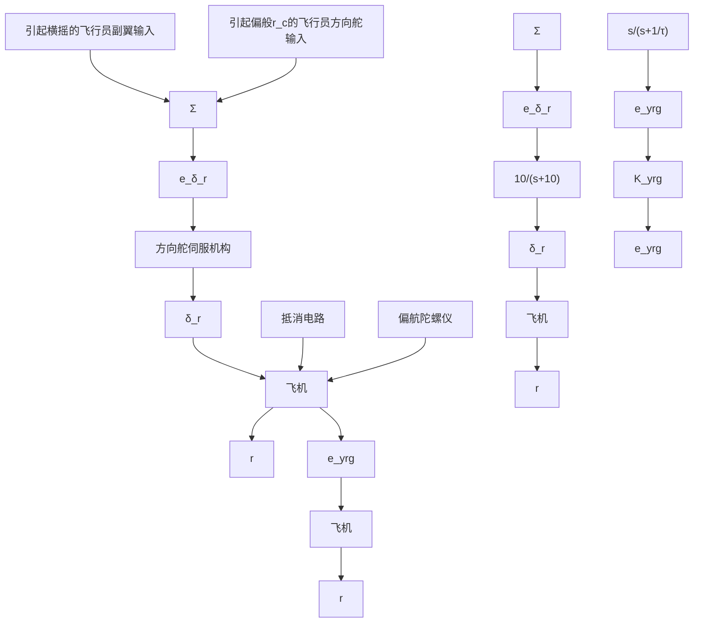

根据系统传递函数可知，系统存在两个稳定的实极点和一对稳定的复数极点。首先需要注意的是，系统低频增益为负，这与一个简单的物理事实相对应，即正向或者顺时针转动方向舵能够引起负向或者逆时针的偏航速度。换句话说，左转方向舵（顺时针），飞行器的机头将会向左旋转（逆时针）。相应于复数极点的自然运动称为荷兰滚；这个名字来源于一个在荷兰冰冻运河上滑冰的人的动作。相应于稳定实极点的运动称为螺旋模式 $s_{1}=-0.0073$ 和滚动模态 $s_{2}=-0.563$ 。从系统的极点可以看出，为了使飞行器易于操控，需要修正的不良模态是荷兰滚，其对应的极点是 $s = -0.033 \pm 0.95$ j。此时根轨迹存在一个可以接受的频率，但是其阻尼比 $\zeta \approx 0.03$ ，远小于要求的 $\zeta \approx 0.5$ 。

步骤 5 尝试超前滞后或 PID 设计。作为设计过程中的首次尝试，我们将考虑偏航角速度对方向舵产生的比例反馈。以反馈增益为参数的根轨迹如图 10.32 所示，其频率响应如图 10.33 所示。从图中可以发现， $\zeta\approx0.45$ 是可以实现的，并且可以计算出其所对应的增益约为 3.0。

  
图 10.32 带有比例反馈的偏航阻尼器的根轨迹

line

| ω (rad/s) | 相位 |
| --- | --- |
| 0.1 | -100° |
| 1 | -50° |
| 10 | -150° |

图 10.33 带有比例反馈的偏航阻尼器的伯德图

然而，当偏航角速度为常值时，这个反馈会在平稳转向期间产生一个不利的情况：为了获得相同的偏航角速度，系统必须引入一个相比于开环系统中更大的稳态输入，这是因为该反馈产生了一个与偏航角速度方向相反且稳定的方向舵输入。这个难题可以通过削弱直流反馈来解决（也就是“抵消”反馈）。可以通过在反馈中插入

$$H (s) = \frac {s}{s + 1 / \tau}$$

来实现，当频率高于 $1 / \tau$ 时，传递偏航角速度反馈，而在直流时不提供任何反馈。因此，在稳定转向期间，阻尼器将不会提供任何校正。图10.34给出了带有抵消电路的偏航阻尼器的框图。

flowchart

图 10.34 偏航阻尼器

对于一个更加完整的模型而言，还应该包括方向舵伺服机构，它代表执行器动态性能，其传递函数为

$$A (s) = \frac {\delta_ {r} (s)}{e _ {\delta_ {r}} (s)} = \frac {1 0}{s + 1 0}$$

相比系统的其他部分，它的响应速度快得多，因此，我们不期望其对系统的响应有太大的改变。包含执行器动态和抵消电路的系统在 $\tau = 3$ 时的根轨迹如图10.35所示。从根轨迹中可以看出，偏航角速度反馈的引入（包含抵消电路）

line

| Re(s) | Im(s) |
| --- | --- |
| -8.47 | 1.0 |

图 10.35 在 $\tau=3$ 时带有抵消电路的根轨迹
