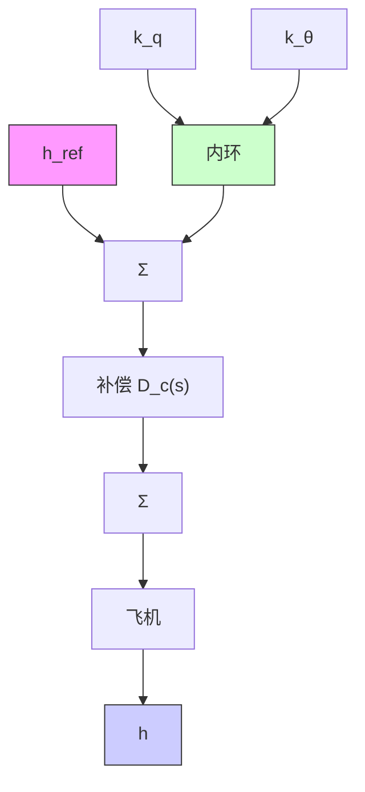

$$\frac {h (s)}{\delta_ {\mathrm{e}} (s)} = \frac {3 2 . 7 (s + 0 . 0 0 4 5) (s + 5 . 6 4 5) (s - 5 . 6 1)}{s (s + 0 . 0 0 3 \pm 0 . 0 0 9 8 \mathrm{j}) (s + 0 . 6 4 6 3 \pm 1 . 1 2 1 1 \mathrm{j})} \tag {10.30}$$

该系统具有两对稳定的复极点和一个 s=0 的极点。用 Matlab 的 eig 命令计算出的一对复极点 $-0.003 \pm 0.0098j$ 称为振荡模态 $^{\ominus}$ ，另一对复极点 $-0.6463 \pm 1.1211j$ 称为短周期模态。

步骤 5 尝试超前滞后或 PID 控制器设计。设计的第一步，通常使用一个内环反馈将俯仰角速度 q 反馈给 $\delta_{e}$ ，从而提高飞行器在短周期模态下的阻尼（见图 10.39）。用 Matlab 的 ss2tf 函数可获得从 $\delta_{e}$ 到 q 的传递函数为

$$\frac {q (s)}{\delta_ {\mathrm{e}} (s)} = - \frac {2 . 0 8 s (s + 0 . 0 1 0 5) (s + 0 . 5 9 6)}{(s + 0 . 0 0 3 \pm 0 . 0 0 9 8 \mathrm{j}) (s + 0 . 6 4 6 \pm 1 . 2 1 \mathrm{j})} \tag {10.31}$$

由等式(10.31)可知，q 反馈的内环根轨迹如图 10.40 所示。考虑到 $k_{q}$ 是根轨迹参数，因此系统矩阵[式(10.28)]可修改为

$$\mathbf {A} _ {q} = \mathbf {A} + k _ {q} \mathbf {B C} _ {q} \tag {10.32}$$

flowchart

图 10.39 定高度反馈系统

text_image

k_q = 1时的极点
-2
-1
Re(s)
Im(s)
1
-1
-1

图 10.40 带有 q 反馈的定高度动态系统的内环根轨迹

其中：A 和 B 在式(10.28)中已定义； $C_{q}=\left[\begin{array}{cccccc}0 & 0 & 1 & 0 & 0\end{array}\right]$ 。选择一个适当的增益 $k_{q}$ 的过程是一个迭代的过程。其选择步骤与第 5 章中讨论过的一样（回顾 5.6.2 小节中测速计反馈的例子）。如果我们选择 $k_{q}=1$ ，那么闭环极点将位于根轨迹的 $-0.0039\pm0.0067j$

和 $-1.683\pm0.277j$ 处，并且

$$
\mathbf {A} _ {q} = \left[ \begin{array}{c c c c c} - 0. 0 0 6 4 3 & 0. 0 2 6 3 & 0 & - 3 2. 2 & 0 \\ - 0. \dot {0} 9 4 1 & - 0. 6 2 4 & 7 8 3. 3 & 0 & 0 \\ - 0. 0 0 0 2 2 2 & - 0. 0 0 1 5 3 & - 2. 7 5 & 0 & 0 \\ 0 & 0 & 1 & 0 & 0 \\ 0 & - 1 & 0 & 8 3 0 & 0 \end{array} \right] \tag {10.33}
$$

743

注意到， $A_{q}$ 中只有第三列不同于A。为了进一步提高系统阻尼，我们发现反馈飞行器的俯仰角是很有用的。通过试验和分析误差，我们选择

$$
\boldsymbol {K} _ {\theta \eta} = \left[ \begin{array}{l l l l l} 0 & 0 & - 0. 8 & - 6 & 0 \end{array} \right]
$$

为了反馈 $\theta$ 和 q，系统矩阵可写成如下形式：

$$
\mathbf {A} _ {\theta_ {l}} = \mathbf {A} _ {q} - \mathbf {B K} _ {\theta_ {l}} = \left[ \begin{array}{c c c c c} - 0. 0 0 6 4 & 0. 0 2 6 3 & 0 & - 3 2. 2 & 0 \\ - 0. 0 9 4 1 & - 0. 6 2 4 & 7 6 1 & - 1 9 6. 2 & 0 \\ - 0. 0 0 0 2 & - 0. 0 0 1 5 & - 4. 4 1 & - 1 2. 4 8 & 0 \\ 0 & 0 & 1 & 0 & 0 \\ 0 & - 1 & 0 & 8 3 0 & 0 \end{array} \right]
$$

其中：极点为 s = 0，-2.25 ± 2.99j，-0.531，-0.0105。
