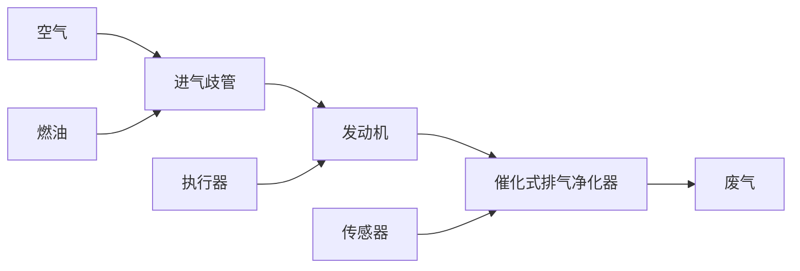

# 10.4 汽车发动机的空燃比控制

直到20世纪80年代，大多数的汽车发动机仍然用汽化器来检测燃油量，以使得汽油质量流量与空气质量流量之比，或说成空燃比 $(F / A)$ ，保持在 $1:15$ 附近。汽化器利用空气流经文氏管时产生的压降来测量燃油量。该装置能够保持发动机以令人满意的状态运行，但是它在过去却允许 $F / A$ 偏移量达到 $20\%$ 。在联邦废气污染法规实施后，不允许排放过量的碳氢化合物(HCs)和过量的一氧化碳(CO)，因此 $F / A$ 级别标准的不确定程度是不能被接受的。在20世纪70年代期间，汽车生产厂商改进了汽化器的设计和制造工艺，以使得它们的测量更精确，从而将 $F / A$ 偏移量控制在 $3\% \sim 5\%$ 。通过综合各种因素，这种提高 $F / A$ 精度的措施有助于降低废气污染水平。然而，因为系统并没有测量进入到发动机中的混合气体 $F / A$ 并进而将它反馈给汽化器，所以汽化器仍然是开环装置。在20世纪80年代期间，为了大幅度提高 $F / A$ 的精度，几乎所有的汽车制造商都转向反馈控制系统，这是为了降低废气污染程度而采取的一项必要措施。实际上，现阶段（2014年）也使用相同的方案，以便安装在排气系统中的催化式排气净化器可以清除掉废气污染并且达到联邦政府制定的标准。

现在我们将再次使用 10.1 节所描述的循序渐进的设计方法，来为发动机控制设计一个典型的反馈系统。

步骤1 理解控制过程以及其性能。为了达到废气污染指标，我们所选择的方法是使用催化式排气净化器，该装置能同时氧化过量的一氧化碳(CO)和未燃烧的HC以及减少过量的氮氧化合物含量(NO和 $\mathrm{NO}_2$ 以及NOx)。由于这种装置对三种污染物都有影响，因此通常称为三元催化器。当 $F / A$ 与1:14.7的化学计量配比相差较大时，该催化器就会失效；因此，需要一个反馈控制系统来维持 $F / A$ 在期望值的正负 $1\%$ 内变化。 $F / A$ 反馈控制系统如图10.46所示。

flowchart

图 10.46 F/A 反馈控制系统

影响从废气中检测的 F/A 输出和在进气歧管中燃油/计量输入之间关系的动态因素有：（1）引入的燃油和空气混合物数量，（2）由于发动机中活塞行程所引起的周期延时，（3）废气从发动机运动到传感器所需的时间。以上因素很大程度上依赖发动机的转速和载荷。例如：发动机转速从 600r/min 变到 6000r/min。这些变化的结果是，依赖于操作环境，影响反馈系统行为的延时也会至少以 10:1 的比例变化。由于司机需要通过加速踏板的变化来获得或多或少的动力（该变化会持续几分之一秒），因此系统会经历一个暂态过程。理想条件下，反馈控制系统应该能够跟随上这些暂态变化。

步骤 2 选择传感器。废气传感器的出现与发展是一个关键的技术步骤，它使得通过反馈控制实现废气减排的这种想法成为可能。装置中的活性元素、锆氧化物放置在废气流中，在那里能产生一个电压，该电压是废气中氧含量的单调函数。F/A值与氧气量有特定的关系。传感器的输出电压与F/A之间存在严重的非线性（见图10.47）；几乎所有的电压变化都恰巧发生在F/A值处，并且在F/A值处，为了实现催化器的有效性能，反馈系统必然会运转。因此，当F/A在期望点(1:14.7)时，传感器的增益将是非常高的，反之亦然。

line

| 空燃比, F/A | 传感器输出, V |
| --- | --- |
| 1:18 | 0.1 |
| 1:14.7 | 0.5 |
| 1:12 | 0.9 |

图 10.47 废气传感器的输出

尽管用于 F/A 反馈控制的其他类型传感器已经处于研发阶段，但迄今为止还没有找到性价比高并且具有很好的工作性能的传感器。目前所有的汽车制造商在汽车发动机的反馈控制系统中都是用锆氧化合物类型的传感器。
