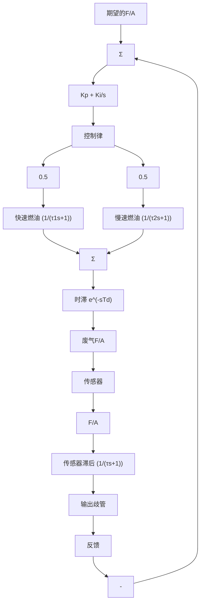

步骤3 选择执行器。可通过汽化器或者燃油注入实现燃油计量。为实现 $F / A$ 反馈系统，需要用电信号来调整燃油计量，这是因为传感器输出的是电信号。最初，为了提供这种能力，所设计的汽化器包含了一个可以调整大小的通气口，这个通气口可根据电信号误差大小来调整初始燃油的流量。但是，现如今汽车制造商通过燃油注入便可完成燃油量的测量。燃油注入系统天生就是典型的电控装置，因此只要其能够利用传感器的反馈信号，就能轻易地通过 F/A 反馈进行燃油调节。如今，每一个气缸的入口都放有一个燃油注入器（称为多点注入）；而在过去，所有的气缸入口处共用一个大的燃油注入器（称为单点或者节流阀注入）。多点注入提供了更好的性能，这是因为燃油可以与发动机充分接触，并且对气缸分配更加合理。燃油与发动机更接近可以减少延时，因此能够产生更好的电动机响应，使得废气污染更低。

步骤4 建立线性模型。从图10.47可以看出，传感器具有非常严重的非线性，因此基于线性化模型的设计工作需要额外小心。图10.48给出了系统的框图，其中传感器的增益为 $K_{s}$ 。进气歧管动态模型中的时间常数 $\tau_{1}$ 与 $\tau_{2}$ 分别代表了燃油呈气体或小滴状态时的快速流动和在歧管壁上呈液体薄膜状态时的慢速流动。时延是两部分之和：（1）活塞经历四个冲程，即从进气过程到排气过程，所需的时间；（2）废气从发动机移动到1ft外的传感器所需的时间。为了解决发生在排气歧管中的气体混合现象，这个过程也需要含有一个带有滞后时间常数为 $\tau$ 的传感器。尽管时间常数和延迟时间会因为其是发动机载荷和转速的函数而有很大的改变，但是我们将在一个确定点处对设计进行检验，这里各参数分别取为

$$\tau_ {1} = 0. 0 2 \mathrm{s}, \quad T _ {\mathrm{d}} = 0. 2 \mathrm{s}\tau_ {2} = 1 \mathrm{s}, \quad \tau = 0. 1 \mathrm{s}$$

在实际的发动机中，设计必须考虑所有的速度载荷。

flowchart

图 10.48 F/A 控制系统的框图

步骤5 尝试超前滞后或PID控制器设计。由于给定了严格的误差指标和发动机变化的操作条件所需求的不同的燃油输入量 $U_{\mathrm{f}}$ ，引入一个积分控制项是必不可少的。通过积分控制，当误差信号 $e = 0$ 时，可以提供任何需求的稳态 $U_{\mathrm{f}}$ 。附带的比例环节，尽管不常用，但会增加(倍增)带宽并且也不会降低稳态特性。在这个例子中，我们采用比例积分控制（PI）。控制器的输出是电压信号，它可以驱动注入器的脉冲发生器产生一个燃油脉冲，脉冲的持续时间与电压值成正比。该控制器的传递函数可以写成

$$D _ {\mathrm{c}} (s) = K _ {\mathrm{p}} + \frac {K _ {\mathrm{I}}}{s} = \frac {K _ {\mathrm{p}}}{s} (s + z) \tag {10.35}$$

其中：

$$z = \frac {K _ {\mathrm{I}}}{K _ {\mathrm{p}}}$$

且 z 可以根据需要选择。

首先，我们假设传感器是线性的，且可以用增益 $K_{s}$ 来表示。然后，选择使得系统具有良好稳定性与良好响应的z值。图10.49给出了 $K_{s}K_{p}=1.0$ 、z=0.3时系统的频率响应，而图10.50给出了z=0.3时以 $K_{s}K_{p}$ 为参数的系统根轨迹。两种分析方式均表明当

$K_{s}K_{p}$ 约为 2.8 时，系统是不稳定的。从图 10.49 可以发现，为了得到大约 $60^{\circ}$ 的相位裕度， $K_{s}K_{p}$ 应该在 2.2 左右。从图 10.49 中我们还可以发现其相应的穿越频率为 $6\,rad/s$ （约为 $1\,Hz$ ）。从图 10.50 的根轨迹中可以证实这种备选方案将获得一个可被接受的阻尼比值 ( $\zeta\approx0.5$ )。
