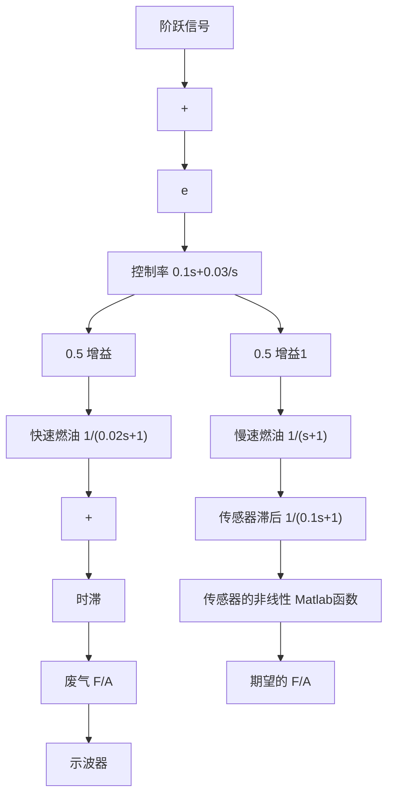

line

| ω (rad/s) | 相位 |
| --- | --- |
| 0.1 | -90° |
| 0.4 | -60° |
| 1 | -60° |
| 2 | -65° |
| 4 | -120° |
| 10 | -180° |
| 20 | -210° |
| 40 | -210° |
| 100 | -210° |

图 10.49 PI F/A 控制器的伯德图

虽然这种线性分析表明，在合适的带宽(大约1Hz)下，使用PI控制器能够得到可以接受的稳定性，但由非线性传感器的特性(见图10.47)可知，这是不可能实现的。值得注意的是，传感器的输出斜率在期望设定点附近是非常大的，因此将会产生一个非常大的 $K_{s}$ 值。所以，当系统包含了高增益传感器的影响时，需要选用较小的控制器增益 $K_{p}$ 来使得 $K_{s}K_{p}$ 的值保持为2.2。另一方面，一个在F/A=1:14.7(=0.068)处产生使系统稳定的充分小的 $K_{p}$ 值将对大幅度偏离设定点的暂态误差产生一个非常迟钝的响应，这是因为有效的传感器增益将会大幅降低。因此，为了使系统在任何情况下(除了仅在设定点处有微小干扰)都能获得令人满意的响应特性，我们必须解决传感器的非线性问题。对传感器初步的近似如图10.51所示。由于在设置点处实际的传感器增益与其近似值仍然有很大的差异，所以这种近似会产生一些与设定点处稳定性相关的错误结论；但是，在仿真过程中，这种近似对于确定初始条件的响应是有用的。

line

| Re (s) | Im (s) |
| --- | --- |
| -15 | 2.8 |
| -10 | 2.2 |
| -5 | 2.8 |
| 0 | 2.2 |
| 5 | 2.8 |

图 10.50 PI F/A 控制器的根轨迹

line

| 时间 | 实际的传感器 | 近似后的传感器 |
| --- | --- | --- |
| 1:18 | 0.1 | 0.1 |
| 1:14.7 | 0.5 | 0.6 |
| 1:12 | 0.9 | 0.9 |

图 10.51 传感器的近似

步骤 6 评估/修正被控对象。非线性传感器不是我们所期望的，但是我们还没有找到合适的线性传感器。

步骤 7 尝试最优控制器设计。系统的响应由传感器的非线性决定，且控制过程中的任意微调都必须考虑该性质。此外，这个系统的动态模型相对来讲是比较简单的，而且也不见得最优设计方法会对 PI 控制器有任何的改进。因此我们将省略这一步。

步骤 8 仿真具有非线性的设计。在 Simulink 中实现的系统非线性闭环仿真如图 10.52 所示。用 Matlab 的 fas 函数表示图 10.52 所示的近似的非线性传感器特性。

flowchart

图 10.52 在 Simulink 中实现的闭环非线性仿真
