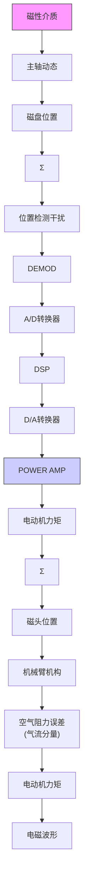

# 10.5 硬盘读/写磁头组件控制

基于在硬盘上记录数据的第一代大容量存储设备是 IBM 公司在 1956 年推出的 350 RAMAC $^{\ominus}$ 模型，它由 50 个直径为 24in 的一堆铝制磁盘组成，并且用一种电磁材料封装。数据以 100B/in 存储到每英寸 20 条的同心轨道上。硬盘的转速为 1200r/min。有一个单一的读/写磁头组件安装在支臂上，它既可以在磁盘之间垂直移动，还可以在选定的磁盘上水平移动来达到需求的数据磁道。磁头借助空气轴承使其悬浮在磁盘的表面，它是从其固定装置上面的小孔里吹出的气流而形成的。磁头组件可通过升降机构固定在某一特定磁盘上，再通过支臂机构固定在某一特定磁道上。整个磁头组件由一台电动机驱动。硬盘拥有 5MB 的数据存储容量，但还必须考虑 36in 的宽度以保证最后的设备能通过。在硬盘设计领域技术领先的是，2000 年由希捷公司推出的一款专为笔记本电脑设计的磁介质硬盘，它拥有3个直径为2.5in的磁盘，转速为15000r/min。这款硬盘的数据存储容量为18350MB。硬盘的读/写组件由一个支臂移动一组梳状的磁头组成，梳状机构在每一面以旋转运动的方式来移动磁道间的磁头。磁头安装在支臂末端的一个万向节上并且悬浮于磁盘表面。为了沿着磁道旋转，磁头组件利用在每个磁道中用户数据扇区之间记录的样本位置数据进行动态反馈控制。从经济学角度来看，硬盘设计领域取得的进步是巨大的，RAMAC每兆字节的花费大约为10000美元，而现代磁盘每兆字节花费不到1美分。阿布

拉莫维奇（Abramovitch）和富兰克林在2002年参考了许多资料后撰写了一份记录卓越历史的简短概要，并且在表10.1中提供一份不同年代的一些磁盘参数对照表。在过去的50年中，来自工业领域和学术机构的大批人员，为硬盘存储技术的进步贡献了许多技术，其中一项授权技术就是反馈控制。图10.54所示的为希捷公司推出的4TB硬盘的图片。在这个简短的实例研究中，我们将指出包括控制在内的一系列问题，但是设计实例仅仅与磁道跟踪这个问题有关。我们将按照10.1节给出的步骤来讨论这个实例。

natural_image

Close-up of a hard disk drive head with visible internal components and mounting brackets (no text or symbols)

图 10.54 希捷 4TB 硬盘驱动器

步骤 1 理解控制过程。图 10.55 给出了磁道追踪中伺服机构的分解框图。该机构包括一个旋转的音圈电动机带动一个轻质的支臂组件，此构件支撑着安装有万向架的滑动器，它包括磁阻读头和薄膜式电感写头。滑块可凭借磁盘旋转产生的气流悬浮在磁盘的表面。功率放大器通常以电流放大器的方式接入电路，磁头的基本运动就可以用简单的惯性模型来表示：

$$G _ {0} (s) = \frac {A}{J s ^ {2}} \tag {10.36}$$

其中：J 是总惯量；A 包括电动机力矩常数和放大器增益。整个结构十分灵巧方便，但是细节动作因为伴随着许多低阻尼模式而变得十分烦琐。该结构也会受到气流以及外壳振动所带来的影响。为便于控制设计，如下模型包含了一个简单的谐振模式：

$$G (s) = \frac {A}{J s ^ {2}} \frac {(2 \zeta \frac {s}{\omega_ {1}} + 1)}{\left(\frac {s ^ {2}}{\omega_ {1}} + 2 \zeta \frac {s}{\omega_ {1}} + 1\right)} \tag {10.37}$$

flowchart

图 10.55 磁道跟踪模型的总体视图

表 10.3 硬盘驱动器参数
