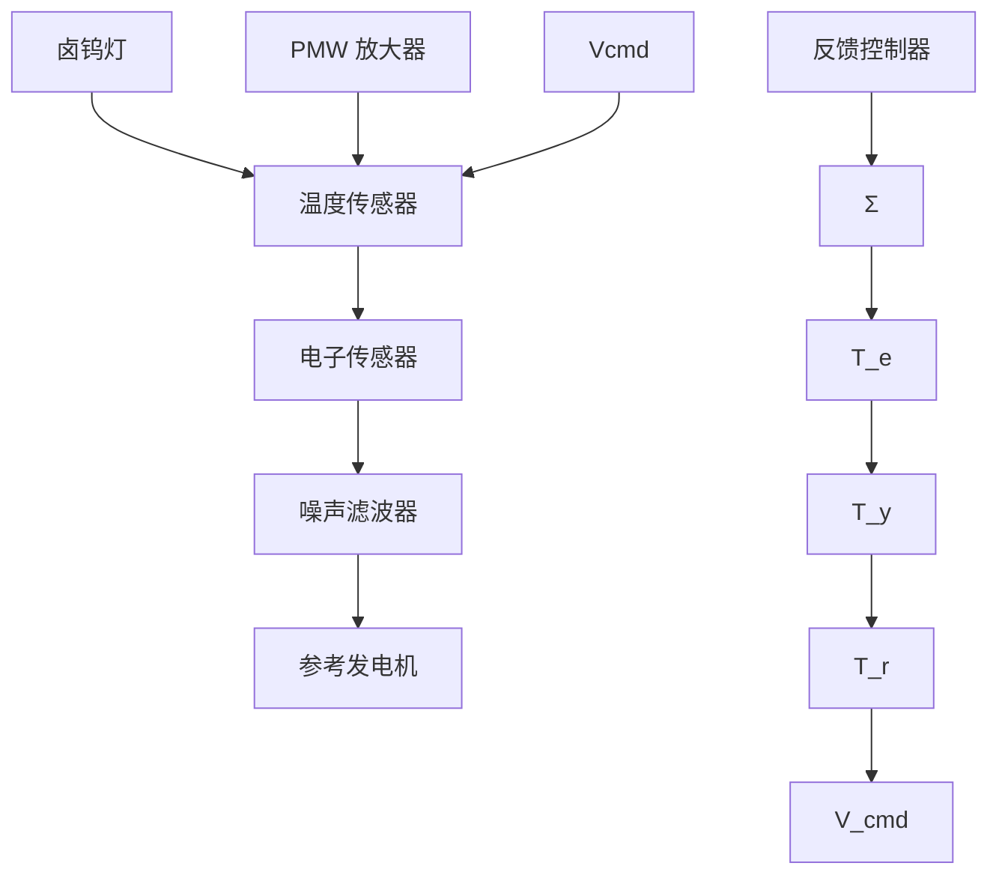

flowchart

图 10.66 RTP 实验模型的框图

步骤 1 理解控制过程及其性能指标。RTP 是一个固有动态的非线性过程。该系统令人关注的性能包括多样的时间尺度(灯管、晶片、发射头、石英窗的时间常数都不同)、非线性(主导的辐射)特性、非线性灯管、电源效应、传感器的数量及位置、灯管的数量、位置及组合、温度的大幅变化等。由于在辐射损失中非线性的增加，因此系统的直流增益会随着温度的升高( $\delta$ 温度/ $\delta$ 功率)而减小。我们需要考虑多种类型的物理模型。这是由于装置的设计需要详尽的物理模型，但是几何形状变化的快速评估，方法改进及反馈控制的设计，都需要降阶模型。同时还需要手动控制和自动控制之间的平滑过渡。

步骤 2 选择传感器。前面已经讨论过。对于实验模型而言，传感器是一组 14 个 RTD 的器件，但只有 3 个（分别位于板中央和两边的支脚上）用于反馈，其余的用于温度监控。本例中，我们仅选中心温度用于反馈控制（另一个方法是将 3 个温度值相加作为一个信号来控制平均温度）。

步骤 3 选择执行器。前面也已经讨论过。对于实验模型而言，执行器由 3 个前文所描述的标准的卤钨灯组成。本例中，我们将这3个灯管组成一个单执行器，并对每一个灯管使用相同的输入量。

步骤 4 建立线性模型。实验模型已经建立(详见步骤 9)。非线性系统方程包括传导项(见第 2 章)及辐射项(Emami-Naeini 等, 2003)。非线性系统辨识方法可用于得到系统模型。特别地, 这 3 个灯管的电压逐步升高, 然后保持不变, 随后逐步降低, 记录下 3 个输出温度。通过系统辨识 $^{①}$ 方法得到系统非线性模型, 其中包含辐射项和传导项(分别为 $A_{r}$ 和 $A_{con}$ ):

$$
\boldsymbol {M} \dot {\boldsymbol {T}} = \boldsymbol {A} _ {\mathrm{r}} \left[ \begin{array}{l} \boldsymbol {T} \\ T _ {\infty} \end{array} \right] ^ {4} + \boldsymbol {A} _ {\mathrm{con}} \left[ \begin{array}{l} \boldsymbol {T} \\ T _ {\infty} \end{array} \right] + \boldsymbol {B u} \tag {10.42}
$$

其中： $T=\left[T_{1}\quad T_{2}\quad T_{3}\right]^{T}$ 表示温度； $T_{\infty}$ 为不变环境温度( $\dot{T}_{\infty}=0$ )； $u=\left[v_{cmd1}\quad v_{cmd2}\quad v_{cmd3}\right]^{T}$ 是控制电压值。其系统矩阵为

$$
\boldsymbol {M} ^ {- 1} = \left[ \begin{array}{l l l} 1. 0 0 0 0 4 0 & 0 & 0 \\ 0 & 5. 5 5 7 4 4 3 & 0 \\ 0 & 0 & 1 3. 6 3 8 2 1 8 \end{array} \right]

\mathbf {A} _ {\mathrm{r}} = \left[ \begin{array}{c c c c} 5. 4 7 6 2 \times 1 0 ^ {- 2} & - 8. 5 7 0 6 \times 1 0 ^ {- 3} & - 8. 2 9 6 1 \times 1 0 ^ {- 4} & - 4. 5 3 6 1 \times 1 0 ^ {- 2} \\ - 8. 5 7 0 6 \times 1 0 ^ {- 3} & 8. 5 7 0 9 \times 1 0 ^ {- 3} & - 1. 6 2 1 3 \times 1 0 ^ {- 7} & - 8. 9 1 3 4 \times 1 0 ^ {- 8} \\ - 8. 2 9 6 1 \times 1 0 ^ {- 4} & - 1. 6 2 1 3 \times 1 0 ^ {- 7} & 8. 2 9 9 8 \times 1 0 ^ {- 4} & 2. 0 9 7 6 \times 1 0 ^ {- 7} \end{array} \right]
