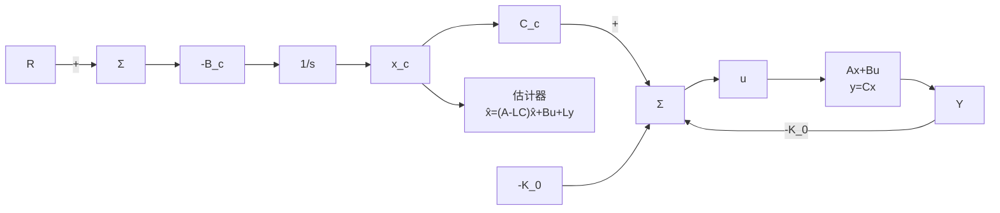

$$R _ {\mathrm{w}} = 1, \quad R _ {\mathrm{v}} = 0. 0 0 1$$

下面的 Matlab 命令用于设计估计器：

$$[ \mathrm{L} ] = \mathrm{lqe} (\mathrm{A}, \mathrm{B}, \mathrm{C}, \mathrm{R} _ {\mathrm{w}}, \mathrm{R} _ {\mathrm{v}})$$

所得的估计器增益矩阵为

$$
\boldsymbol {L} = \left[ \begin{array}{l} 1 6. 1 4 6 1 \\ 1 6. 4 7 1 0 \\ 1 3. 2 0 0 1 \end{array} \right]
$$

估计器的误差极点在-16.5268，-0.1438和-0.0876处，估计器方程为

$$\dot {\hat {T}} = A \hat {T} + B u + L (y - C \hat {T}) \tag {10.46}$$

利用估计器，系统内部模型控制器的方程可修正为

$$\dot {x} _ {\mathrm{c}} = B _ {\mathrm{c}} eu = C _ {\mathrm{c}} x _ {\mathrm{c}} - K _ {0} \hat {T} \tag {10.47}$$

闭环系统方程由下式给出：

$$\dot {\boldsymbol {x}} _ {\mathrm{cl}} = \boldsymbol {A} _ {\mathrm{cl}} \boldsymbol {x} _ {\mathrm{cl}} + \boldsymbol {B} _ {\mathrm{cl}} ry = C _ {\mathrm{cl}} x _ {\mathrm{cl}} + D _ {\mathrm{cl}} r \tag {10.48}$$

其中： $r$ 是参考输入温度轨线；闭环状态矢量为 $x_{\mathrm{cl}} = [T^{\mathrm{T}} x_{\mathrm{c}}^{\mathrm{T}} \hat{T}^{\mathrm{T}}]^{\mathrm{T}}$ 。系统矩阵为

$$
\mathbf {A} _ {\mathrm{cl}} = \left[ \begin{array}{c c c} \mathbf {A} & \mathbf {B C} _ {\mathrm{c}} & - \mathbf {B K} _ {0} \\ B _ {\mathrm{c}} \mathbf {C} & \mathbf {0} & \mathbf {0} \\ L C & B C _ {\mathrm{c}} & \mathbf {A} - \mathbf {B K} _ {0} - L C \end{array} \right], \quad \mathbf {B} _ {\mathrm{cl}} = \left[ \begin{array}{c} \mathbf {0} \\ - B _ {\mathrm{c}} \\ \mathbf {0} \end{array} \right], \quad C _ {\mathrm{cl}} = [ C \quad \mathbf {0} \quad \mathbf {0} ], \quad D _ {\mathrm{cl}} = [ 0 ]
$$

闭环极点（由 Matlab 计算所得）位于 $-0.5574 \pm 0.4584j$ ，-0.1442，-0.0877，-16.5268，-0.1438 和 -0.0876 处，同预期的一致。闭环控制系统的结构如图 10.68 所示。

flowchart

图 10.68 闭环控制的结构框图
