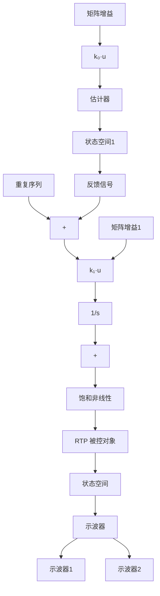

闭环控制系统结构如图 10.69 所示。线性闭环响应如图 10.70a 所示，相应的控制效果如图 10.70b 所示。受控温度轨线 r，在 $0 \sim 25^{\circ}C$ 范围内是斜率为 $1^{\circ}C/s$ 的斜线，之后为 50s 的吸收时间，然后降为 $0^{\circ}C$ （注意到此处的坡度比较平缓，这是因为这里对于 RTP 实验模型我们仅使用3个灯管，而实际的RTP系统需要上百个灯管，并且会像前面提到有更快的斜坡速度）。系统可有效的跟踪受控温度轨线，即使在斜坡处有大约2s的延时和最大为0.089℃的超调。像预期的一样，系统可跟踪稳态输入并渐近地达到零稳态误差。考虑到跟踪斜坡输入，灯管的控制信号如预期那样增加，并在25s时达到最大值，然后在大约35s时降低为稳态值。标准的灯管响应在0～75s内，随后几秒是相应的快速冷却产生的负控制电压。又由于系统中没有实时冷却系统，所以负控制电压（如图中的虚线所示）事实上是不可实现的。因此，在非线性仿真中，受控的灯管电压源必须限制为严格非负（详见步骤8）。需要注意的是从75～100s的响应是系统的(负)阶跃响应。

flowchart

图 10.69 RTP 闭环控制的仿真框图

line

| 时间/s | 温度/K (r) | 温度/K (y) |
| --- | --- | --- |
| 0 | 0 | 0 |
| 20 | 25 | 25 |
| 70 | 25 | 25 |
| 80 | 0 | 0 |
| 100 | 0 | 0 |

a）温度跟踪响应

line

| 时间/s | 灯管电压 |
| --- | --- |
| 0 | -1 |
| 10 | 2 |
| 20 | 4 |
| 30 | 2 |
| 40 | 2 |
| 50 | 2 |
| 60 | 2 |
| 70 | -2 |
| 80 | -14 |
| 90 | -1 |
| 100 | -1 |

b）控制效果  
图 10.70 鲁棒伺服机构控制器的线性闭环 RTP 响应

步骤8 仿真具有非线性的设计。如图10.71所示，非线性闭环系统可运用Simulink进行仿真。模型的温度单位是K，环境温度是 $301\mathrm{K}^{\ominus}$ 。非线性装置的模型是式(10.42)的具体实现。沿参考温度轨线的前置滤波器（为平滑尖锐的拐点），其传递函数为

$$G _ {\mathrm{pf}} (s) = \frac {0 . 2}{s + 0 . 2} \tag {10.49}$$

注意电压转化为功率的公式为

$$P = V ^ {1. 6} \tag {10.50}$$

据此可将其视为仿真图表上的非线性框图(称为 VtoPower)如图 10.72。静态非线性灯管的模型的逆也作为一个方框包含其中(称为 InvLamp):

$$V = P ^ {0. 6 2 5} \tag {10.51}$$

该模块是为了消除灯阻非线性而设的。从图表中我们可以发现，对系统进行操作时，电压在1～4V范围内变化。灯管包含一个饱和非线性单元，和积分器的反卷逻辑模块一样，用来处理灯管的饱和。非线性动态响应如图10.73a所示，其控制效果如图10.73b所示。注意非线性响应与线性响应大致相同。

flowchart

