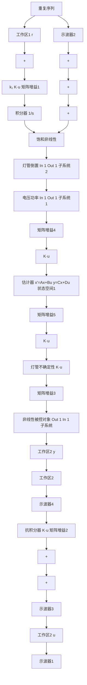
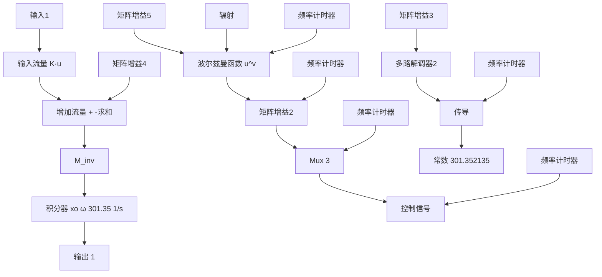
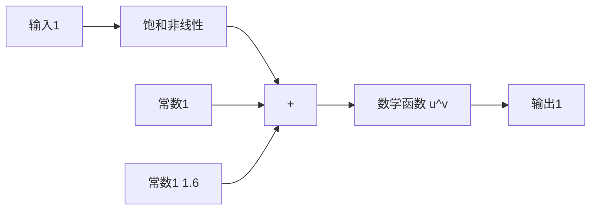
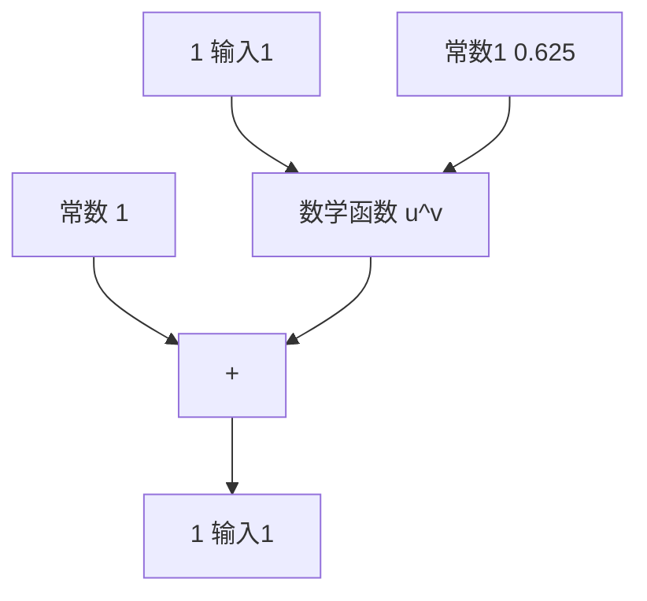

a）非线性闭环

flowchart

b）非线性装置   
图 10.71 非线性 RTP 闭环系统的仿真框图

flowchart

a）电压功率转换子系统

flowchart

b）灯管模型子系统

图 10.72 非线性 RTP 闭环系统的仿真框图  

line

| 时间/s | 温度/K |
| --- | --- |
| 40 | 315 |
| 60 | 333 |
| 100 | 333 |
| 140 | 315 |
| 160 | 315 |

a）温度跟踪响应

line

| 时间/s | 灯管电压/V |
| --- | --- |
| 40 | 1.0 |
| 50 | 2.5 |
| 60 | 3.8 |
| 70 | 2.5 |
| 80 | 2.5 |
| 90 | 2.5 |
| 100 | 2.5 |
| 110 | 1.5 |
| 120 | 1.0 |
| 130 | 0.5 |
| 140 | 0.3 |
| 150 | 0.9 |
| 160 | 0.9 |
| 170 | 0.9 |
| 180 | 0.9 |

b）控制效果  
图 10.73 鲁棒伺服机构控制器的非线性闭环响应
